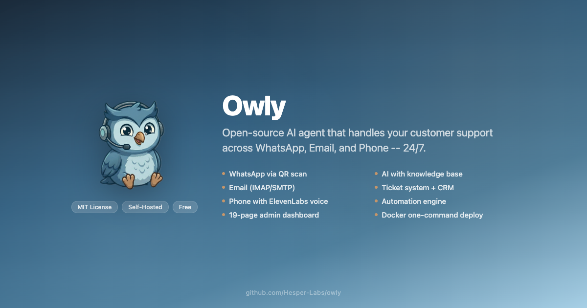
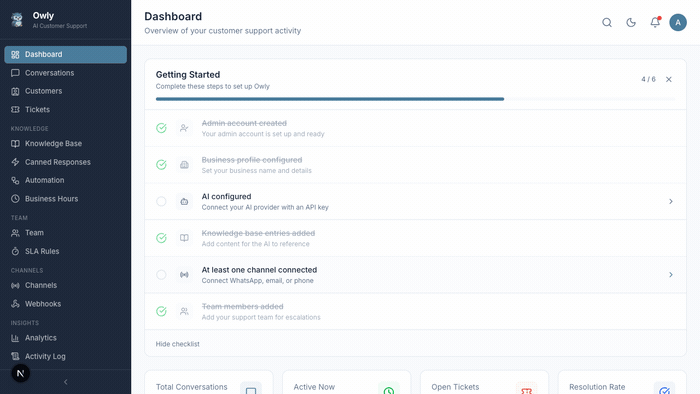
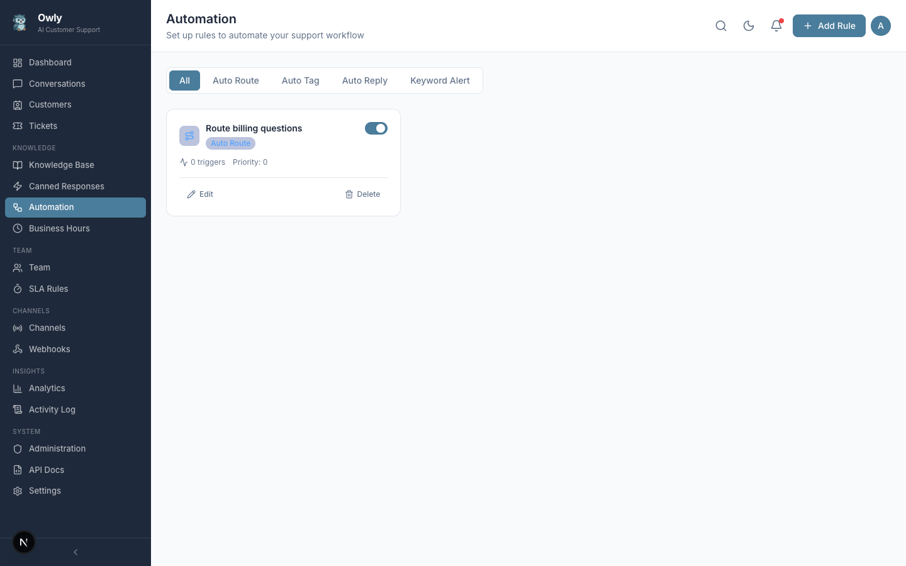
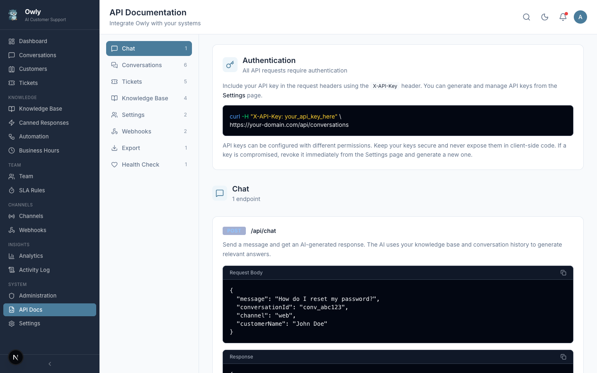
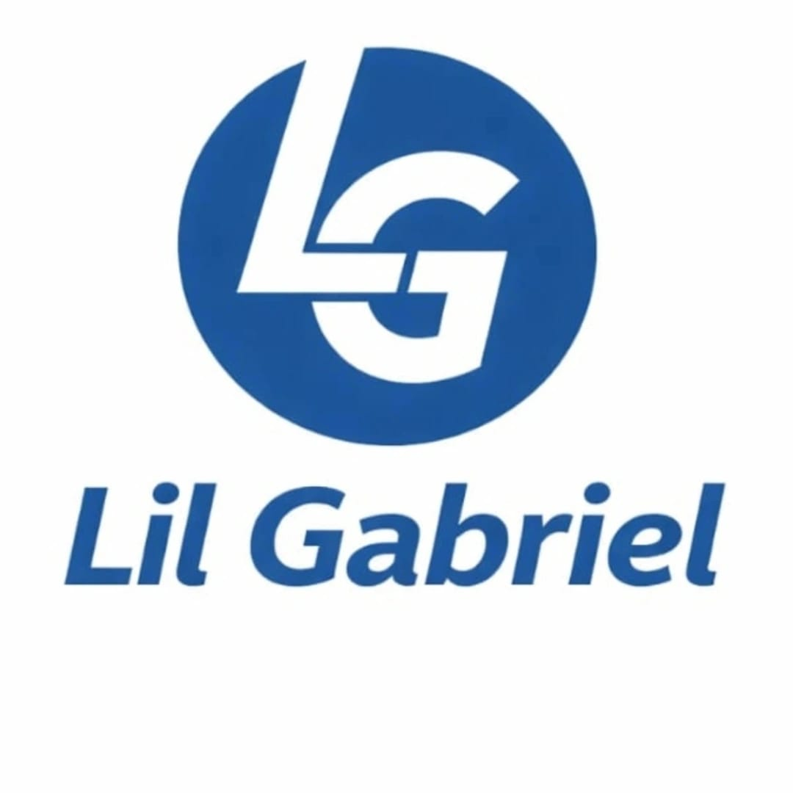

<p align="center">
  
</p>

<p align="center">
  <a href="#features">Features</a> &middot;
  <a href="#screenshots">Screenshots</a> &middot;
  <a href="#quick-start">Quick Start</a> &middot;
  <a href="#configuration">Configuration</a> &middot;
  <a href="#api">API</a> &middot;
  <a href="#tech-stack">Tech Stack</a> &middot;
  <a href="docs/wiki/Home.md">Wiki</a> &middot;
  <a href="#roadmap">Roadmap</a> &middot;
  <a href="CONTRIBUTING.md">Contributing</a>
</p>

<p align="center">
  <a href="https://github.com/LilGabrielDev/gabriel/actions/workflows/ci.yml"></a>
  
  
  
  
  
  
  
  
  
</p>

<p align="center">
  
</p>

---

## What is Gabriel?

Gabriel is a **self-hosted AI customer support agent** that small businesses and individuals can run on their own machines -- completely free. Connect your WhatsApp, Email, and Phone channels, add your business knowledge, and let the AI handle customer inquiries 24/7. Gabriel automatically identifies customers across channels -- someone who emails first and later calls gets a unified profile with full conversation history.

<table>
  <tr>
    <td width="25%" align="center">
      <br/>
      <strong>Zero Cost</strong><br/>
      <sub>No monthly fees. You only pay<br/>for AI API usage.</sub>
      <br/><br/>
    </td>
    <td width="25%" align="center">
      <br/>
      <strong>Your Data, Your Server</strong><br/>
      <sub>Everything runs on your machine.<br/>Complete privacy.</sub>
      <br/><br/>
    </td>
    <td width="25%" align="center">
      <br/>
      <strong>Multi-Channel</strong><br/>
      <sub>WhatsApp, Email, and Phone<br/>from a single dashboard.</sub>
      <br/><br/>
    </td>
    <td width="25%" align="center">
      <br/>
      <strong>5-Minute Setup</strong><br/>
      <sub>Docker Compose or npm.<br/>Guided setup wizard.</sub>
      <br/><br/>
    </td>
  </tr>
</table>

---

## Features

### Multi-Channel Support

Connect all your customer communication channels in one place.

<table>
  <tr>
    <td width="33%">
      <h4 align="center">WhatsApp</h4>
      <p align="center">QR scan or pairing code via external <code>whatsapp-service</code> (Baileys). Host on Katabump, Render, or Railway; connect from the dashboard.</p>
    </td>
    <td width="33%">
      <h4 align="center">Email</h4>
      <p align="center">IMAP/SMTP with any provider. Branded HTML templates with automatic thread tracking.</p>
    </td>
    <td width="33%">
      <h4 align="center">Phone</h4>
      <p align="center">Twilio Voice with OpenAI Whisper (STT) and ElevenLabs (TTS) for natural voice conversations.</p>
    </td>
  </tr>
</table>

<p align="center">
  
  <br/>
  <em>Connect and manage all channels from one screen</em>
</p>

### AI-Powered Conversations

Gabriel uses OpenAI GPT (extensible to Claude, Ollama) with your knowledge base to provide accurate, on-brand responses. During conversations, the AI can autonomously:

- **Create tickets** when customers report problems
- **Route issues** to the right department based on expertise matching
- **Send internal emails** to notify team members about urgent issues
- **Look up customer history** for context-aware support
- **Trigger webhooks** to notify external systems
- **Schedule follow-ups** for proactive customer care

<p align="center">
  
  <br/>
  <em>Unified inbox with conversation thread and admin takeover</em>
</p>

### Customer CRM & Cross-Channel Continuity

Every customer gets a unified profile across all channels -- conversations, notes, tags, and contact history in one place. Gabriel automatically resolves customer identity when someone switches channels (WhatsApp to Email to Phone), keeping the full context available to both the AI and your team.

<p align="center">
  
  <br/>
  <em>Customer profiles with notes, tags, and cross-channel history</em>
</p>

### Knowledge Base

Train your AI with your business information. Organize entries into categories, set priorities, and test responses at `/knowledge/test` before going live.

<table>
  <tr>
    <td width="50%">
      
      <br/>
      <em>Categories with entry counts and color coding</em>
    </td>
    <td width="50%">
      
      <br/>
      <em>Entries with priority levels and active toggles</em>
    </td>
  </tr>
</table>

### Automation Engine

Automate repetitive tasks with rule-based automation, business hours, SLA tracking, and canned responses.

<table>
  <tr>
    <td width="50%">
      
      <br/>
      <em>Auto-route, auto-tag, auto-reply, keyword alerts</em>
    </td>
    <td width="50%">
      
      <br/>
      <em>Quick reply templates with shortcuts</em>
    </td>
  </tr>
</table>

<table>
  <tr>
    <td width="50%">
      
      <br/>
      <em>Weekly schedule with timezone and offline messages</em>
    </td>
    <td width="50%">
      
      <br/>
      <em>Response time targets per channel and priority</em>
    </td>
  </tr>
</table>

### Team & Ticket Management

Organize your team into departments, track issues with a full ticket system, and monitor performance.

<table>
  <tr>
    <td width="50%">
      
      <br/>
      <em>Departments, members, expertise, and availability</em>
    </td>
    <td width="50%">
      
      <br/>
      <em>Priority levels, assignments, and status tracking</em>
    </td>
  </tr>
</table>

### Analytics & Insights

Monitor your support performance with charts, metrics, and team performance tracking.

<p align="center">
  
  <br/>
  <em>Conversation trends, channel breakdown, ticket distribution, and satisfaction scores</em>
</p>

### Administration & API

Manage users, API keys, webhooks, and explore the full REST API with interactive documentation.

<table>
  <tr>
    <td width="50%">
      
      <br/>
      <em>Multi-admin with roles and API key management</em>
    </td>
    <td width="50%">
      
      <br/>
      <em>Interactive API docs with live request testing</em>
    </td>
  </tr>
</table>

### Dashboard & System Tools

- **Quick Actions** — jump to any section from the home dashboard
- **System Status** — live health for app, database, AI, and WhatsApp
- **Global search** — find conversations from the header
- **Help & Sitemap** — all pages and paths at `/help`
- **Onboarding checklist** — guided setup on first login

### Dark Mode

Full dark theme with persistent preference, applied across all 20 dashboard pages.

<p align="center">
  
  <br/>
  <em>Dark mode dashboard with consistent styling across all components</em>
</p>

### More Features

<table>
  <tr>
    <td width="50%">
      
      <br/>
      <em>6-tab settings: General, AI, Voice, Phone, Email, WhatsApp</em>
    </td>
    <td width="50%">
      
      <br/>
      <em>Webhook management with payload preview and testing</em>
    </td>
  </tr>
</table>

---

## Quick Start

### Prerequisites

- **Node.js** 20+
- **Neon Serverless Postgres** or PostgreSQL 16+

### Option 1: npm

```bash
# Clone the repository
git clone https://github.com/LilGabrielDev/gabrielagent.git
cd gabrielagent

# Install dependencies
npm install

# Set up environment
cp .env.example .env
# Edit .env with your Neon DATABASE_URL, DIRECT_URL, and API keys

# Run database migrations
npx prisma migrate dev

# (Optional) Load sample data with a default admin account
npm run db:seed
# Default login: username=admin, password=admin123

# Start the development server
npm run dev
```

For Neon, use the pooled connection string for `DATABASE_URL` and the direct connection string for `DIRECT_URL`.
The pooled hostname includes `-pooler`; Prisma CLI commands use `DIRECT_URL` for migrations and schema pushes.

### Option 2: Docker Compose

```bash
git clone https://github.com/LilGabrielDev/gabrielagent.git
cd gabrielagent

cp .env.example .env
# Edit .env with your API keys

docker compose up -d
```

Open [http://localhost:3000](http://localhost:3000) -- the setup wizard will guide you through the initial configuration.

<p align="center">
  
  <br/>
  <em>Clean login page with Gabriel branding</em>
</p>

---

## Configuration

All configuration is done through the admin dashboard -- no config files to edit after initial setup:

| Setting | Location | Description |
|---------|----------|-------------|
| Business profile | Settings > General | Name, description, welcome message, tone |
| AI provider | Settings > AI Configuration | OpenAI / Claude / Ollama, model, API key |
| Voice | Settings > Voice | ElevenLabs API key and voice selection |
| Phone | Settings > Phone | Twilio Account SID, auth token, phone number |
| Email | Settings > Email | SMTP and IMAP server configuration |
| WhatsApp | Channels > WhatsApp | QR, pairing code, or Business API (via `WHATSAPP_SERVICE_URL`) |
| Team | Team | Departments, members, expertise areas |
| SLA | SLA Rules | Response and resolution time targets |
| Schedule | Business Hours | Weekly availability and offline messages |
| Automation | Automation | Auto-route, auto-tag, auto-reply rules |
| Templates | Canned Responses | Pre-written reply templates |
| Integrations | Webhooks | External service connections |

---

## API

Gabriel provides a full REST API with **OpenAPI 3.0 spec** at `/api/openapi.json`. Interactive documentation with live testing is available at `/api-docs` in the dashboard. All list endpoints are paginated (max 100/page) with standardized response format.

```bash
# Send a message and get AI response
curl -X POST http://localhost:3000/api/chat \
  -H "Content-Type: application/json" \
  -d '{"message": "What are your business hours?", "channel": "api"}'

# Response:
# {"conversationId": "...", "response": "We are open Monday to Friday, 9 AM to 6 PM..."}
```

```bash
# Health check (database, OpenAI, memory, uptime)
curl http://localhost:3000/api/health
# {"status": "ok", "version": "0.2.1", "services": {"database": "connected", "openai": "reachable"}, ...}
```

Every API response includes enterprise headers: `X-Request-Id`, `X-RateLimit-Limit`, `X-RateLimit-Remaining`, `X-API-Version`.

<details>
<summary><strong>View all endpoints</strong></summary>

| Method | Endpoint | Description |
|--------|----------|-------------|
| `POST` | `/api/chat` | Send message, get AI response |
| `GET` `POST` | `/api/conversations` | List or create conversations |
| `GET` `PUT` `DELETE` | `/api/conversations/:id` | Manage a conversation |
| `POST` | `/api/conversations/:id/messages` | Add message (admin takeover) |
| `POST` | `/api/conversations/:id/satisfaction` | Rate conversation (1-5) |
| `POST` | `/api/conversations/:id/notes` | Add internal note |
| `GET` `POST` | `/api/customers` | List or create customers |
| `GET` `PUT` `DELETE` | `/api/customers/:id` | Manage a customer |
| `GET` | `/api/customers/:id/conversations` | Cross-channel conversation timeline |
| `GET` `POST` | `/api/tickets` | List or create tickets |
| `GET` `PUT` `DELETE` | `/api/tickets/:id` | Manage a ticket |
| `GET` `POST` | `/api/knowledge/categories` | Knowledge categories |
| `GET` `POST` | `/api/knowledge/entries` | Knowledge entries |
| `POST` | `/api/knowledge/test` | Test AI with a question |
| `GET` `PUT` | `/api/settings` | Application settings |
| `GET` | `/api/analytics?period=7d` | Analytics data |
| `GET` | `/api/export?type=conversations&format=csv` | Export (CSV/JSON) |
| `GET` `POST` | `/api/automation` | Automation rules |
| `GET` `PUT` | `/api/business-hours` | Business hours config |
| `GET` `POST` | `/api/sla` | SLA rules |
| `GET` `POST` | `/api/canned-responses` | Canned responses |
| `GET` `POST` | `/api/webhooks` | Webhook management |
| `POST` | `/api/webhooks/test` | Test a webhook |
| `GET` `POST` | `/api/webhooks/:id/deliveries` | Delivery log and retry |
| `GET` `POST` | `/api/admin/users` | Admin user management |
| `GET` `POST` | `/api/admin/api-keys` | API key management |
| `GET` | `/api/activity` | Activity audit log |
| `GET` | `/api/health` | Health check |
| `GET` | `/api/openapi.json` | OpenAPI 3.0 specification |

</details>

---

## Tech Stack

| Layer | Technology |
|-------|-----------|
| **Framework** | Next.js 16 (App Router) |
| **Language** | TypeScript 5 |
| **Database** | Neon Serverless Postgres / PostgreSQL 16 + Prisma 7 |
| **UI** | Tailwind CSS 4 + Radix UI |
| **AI** | OpenAI GPT (extensible to Claude, Ollama) |
| **Voice TTS** | ElevenLabs |
| **Voice STT** | OpenAI Whisper |
| **Phone** | Twilio Voice API |
| **WhatsApp** | Baileys (`whatsapp-service`) — QR & pairing on Katabump/Render/Railway |
| **Auth** | JWT + bcrypt (`gabriel-token` cookie) |
| **Testing** | Vitest (309 tests) |
| **Charts** | Pure CSS/SVG (zero dependencies) |
| **Deployment** | Docker Compose / Kubernetes (Helm) |

---

## Project Structure

```
gabrielagent/
├── prisma/                  # Database schema, migrations, seed
├── public/                  # Static assets (logo, chat widget)
├── whatsapp-service/        # Standalone Baileys service (QR/pair/logout)
├── docs/
│   ├── screenshots/         # UI screenshots
│   ├── deployment-vercel.md   # Vercel + WhatsApp split deploy
│   └── wiki/                # Full documentation
├── helm/gabriel/            # Kubernetes Helm chart
├── src/
│   ├── app/
│   │   ├── (auth)/          # Login, setup wizard
│   │   ├── (dashboard)/     # 20 dashboard pages (incl. /help)
│   │   └── api/             # 60+ REST API endpoints
│   ├── components/
│   │   ├── dashboard/       # Quick actions, system status
│   │   ├── layout/          # Sidebar, header
│   │   └── ui/              # Reusable components
│   └── lib/
│       ├── ai/              # AI engine, tools
│       ├── channels/        # WhatsApp proxy, email, phone
│       └── ...
├── tests/                   # Unit, API, security tests
├── docker-compose.yml
├── Dockerfile
├── CONTRIBUTING.md          # Contributor guide (start here)
└── .env.example
```

---

## Documentation

Full documentation is available in the [Wiki](docs/wiki/Home.md):

- [Installation Guide](docs/wiki/Installation-Guide.md)
- [Setup Wizard](docs/wiki/Setup-Wizard.md)
- [Quick Start Tutorial](docs/wiki/Quick-Start-Tutorial.md)
- [API Reference](docs/wiki/API-Reference.md)
- [AI Tool System](docs/wiki/AI-Tool-System.md)
- [Architecture](docs/wiki/Architecture.md)

---

## Deployment

### Vercel

Gabriel can be deployed to **Vercel** for the dashboard and API. WhatsApp QR/pairing runs on a separate **`whatsapp-service`** host (Katabump, Render, Railway, or VPS). Set `WHATSAPP_SERVICE_URL` on Vercel to point at that service.

See [Deploying Gabriel on Vercel](docs/deployment-vercel.md) and [WhatsApp Channel](docs/wiki/WhatsApp-Channel.md).

### WhatsApp Service (Katabump / Render / Railway)

```bash
cd whatsapp-service
npm install
cp .env.example .env
npm run build
npm start
```

Set on the main app:

```env
WHATSAPP_SERVICE_URL="https://your-subdomain.kdns.fr"
WHATSAPP_SERVICE_API_KEY="your-shared-key"
```

### Docker Compose (recommended for most users)

```bash
docker compose up -d
```

### Kubernetes (Helm)

```bash
helm install gabriel helm/gabriel \
  --set database.host=your-postgres-host \
  --set database.password=your-password \
  --set secrets.jwtSecret=$(openssl rand -hex 32) \
  --set secrets.openaiApiKey=sk-... \
  --set ingress.enabled=true \
  --set ingress.hosts[0].host=support.yourdomain.com
```

The Helm chart includes startup/liveness/readiness probes, horizontal pod autoscaling, Ingress with TLS, and init container for database migrations. Set `config.whatsappServiceUrl` for the external WhatsApp service. See [`helm/gabriel/values.yaml`](helm/gabriel/values.yaml).

---

## Roadmap

- [x] Cross-channel customer identity resolution
- [x] Kubernetes Helm chart
- [x] OpenAPI 3.0 specification
- [x] Webhook delivery retry with HMAC signatures
- [x] Pagination on all list endpoints
- [x] Standardized error responses with request tracing
- [ ] Embeddable live chat widget for customer websites
- [ ] WebSocket real-time updates
- [ ] Vector embeddings for semantic knowledge search
- [ ] Role-based access control (RBAC)
- [ ] Telegram, Instagram, SMS channels
- [ ] Shopify / WooCommerce integration
- [ ] Mobile admin (PWA)
- [ ] Multi-tenant / white-label

---

## Contributing

Contributions are welcome! See **[CONTRIBUTING.md](CONTRIBUTING.md)** for setup, feature areas, code style, and the PR checklist.

```bash
git checkout -b feat/your-feature
npm run test && npm run lint && npm run build
git commit -m 'feat: add your feature'
git push origin feat/your-feature
```

Also see the in-app sitemap at `/help` after login.

---

## License

MIT License - see [LICENSE](LICENSE) for details.

---

<p align="center">
  <br/>
  <strong>Gabriel</strong> -- AI Customer Support, Enterprise Grade<br/>
  <sub>Built with Next.js 16, TypeScript, PostgreSQL, and OpenAI</sub>
</p>
