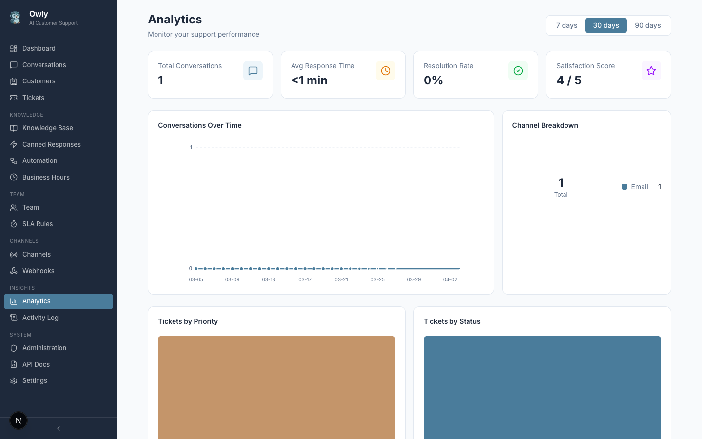

# Analytics

The Analytics page provides a comprehensive overview of your customer support operations. It aggregates data from conversations, tickets, and team performance into visual charts and summary statistics.



---

## Period Selection

At the top of the Analytics page, you can select the time period for all displayed data:

| Period | Description |
|--------|-------------|
| **7 days** | Shows data from the last 7 days. Best for monitoring recent trends and daily performance. |
| **30 days** | Shows data from the last 30 days. Useful for weekly pattern analysis and monthly reviews. |
| **90 days** | Shows data from the last 90 days. Provides a broader view for quarterly reporting and long-term trend analysis. |

Changing the period immediately refreshes all stat cards, charts, and tables on the page.

---

## Stat Cards

Four summary cards are displayed at the top of the page, providing key performance indicators at a glance.

### Total Conversations

The total number of conversations created during the selected period across all channels (WhatsApp, email, phone, web chat, API). This includes both active and closed conversations.

### Average Response Time

The average time between a customer's message and the AI's response, measured across all conversations in the selected period. Displayed in a human-readable format (e.g., "1.2s", "3.5s"). Lower values indicate faster response times.

This metric is calculated from message timestamps within each conversation. It reflects the AI processing time, not human agent response time.

### Resolution Rate

The percentage of conversations that have been resolved or closed out of all conversations in the system. Calculated as:

```
Resolution Rate = (resolved + closed conversations) / total conversations * 100
```

A higher resolution rate indicates that the AI and support team are effectively addressing customer issues.

### Satisfaction Score

The average customer satisfaction rating across all conversations that received a rating in the selected period. Ratings are on a 1--5 scale. Only conversations with a non-null satisfaction value are included in the calculation.

---

## Charts

The Analytics page includes four charts that visualize different aspects of your support data.

### Conversations Over Time (Line Chart)

Displays the number of new conversations per day across the selected period. The x-axis shows dates and the y-axis shows conversation count. Use this chart to identify:

- Peak support days (e.g., after a product launch or marketing campaign).
- Trends in support volume over time.
- Day-of-week patterns.

### Channel Breakdown (Donut Chart)

Shows the distribution of conversations across communication channels. Each channel is represented by a segment with a distinct color:

| Channel | Color |
|---------|-------|
| WhatsApp | Green |
| Email | Blue |
| Phone | Brown |
| Web | Purple |
| Chat | Light Blue |

This chart helps you understand which channels your customers prefer and where to focus optimization efforts.

### Tickets by Priority (Bar Chart)

Displays the count of tickets grouped by priority level during the selected period:

| Priority | Color |
|----------|-------|
| Low | Slate Gray |
| Medium | Amber |
| High | Brown |
| Urgent | Red |

A high proportion of urgent tickets may indicate systemic issues that need attention. Use this chart to assess whether priority assignments are balanced.

### Tickets by Status (Bar Chart)

Shows the distribution of tickets across status categories:

| Status | Color |
|--------|-------|
| Open | Amber |
| In Progress | Blue |
| Resolved | Green |
| Closed | Gray |
| Escalated | Red |

A growing number of open or escalated tickets may signal a need for more team members or knowledge base improvements.

---

## Team Performance Table

Below the charts, a table lists team member performance metrics:

| Column | Description |
|--------|-------------|
| **Member** | The team member's name. |
| **Tickets Resolved** | The number of tickets resolved by this team member during the selected period. |
| **Avg Resolution Time** | The average time this team member takes to resolve a ticket, from assignment to resolution. |

This table helps managers identify top performers and team members who may need additional support or training.

---

## How Metrics Are Calculated

All analytics are computed in real time from the database when the page loads. There is no separate analytics engine or pre-aggregated data.

- **Conversations per day**: Grouped by the `createdAt` date of each conversation within the period.
- **Channel breakdown**: Grouped by the `channel` field on conversations created within the period.
- **Average response time**: Calculated from the time difference between consecutive customer and assistant messages within conversations.
- **Resolution rate**: Ratio of conversations with status `resolved` or `closed` to total conversations.
- **Satisfaction score**: Average of non-null `satisfaction` values on conversations within the period.
- **Tickets by priority/status**: Grouped counts from the tickets table, filtered by the selected period.
- **Team performance**: Aggregated from tickets where `assignedToId` matches a team member and the ticket was resolved within the period.

---

## Using Analytics to Improve Support Quality

### Identify Knowledge Gaps

If the resolution rate is low, review conversations where the AI could not resolve the issue. Common patterns often reveal missing knowledge base entries. Add entries for frequently asked questions that the AI fails to answer.

### Optimize Channel Strategy

Use the Channel Breakdown chart to understand where your customers are. If most conversations come through WhatsApp but your knowledge base is optimized for email-style responses, consider adjusting the AI tone and response length.

### Balance Team Workload

The Team Performance table reveals whether ticket assignments are distributed evenly. If one team member handles significantly more tickets, consider adjusting automation rules or department routing.

### Track Improvement Over Time

Switch to the 90-day view to see long-term trends. After making changes (adding knowledge base entries, adjusting tone, enabling new channels), monitor whether the resolution rate and satisfaction score improve.

### Monitor Escalation Rates

A high number of escalated tickets in the Tickets by Status chart suggests that the AI frequently cannot handle customer issues. This is a strong signal to expand the knowledge base or adjust the AI configuration.
