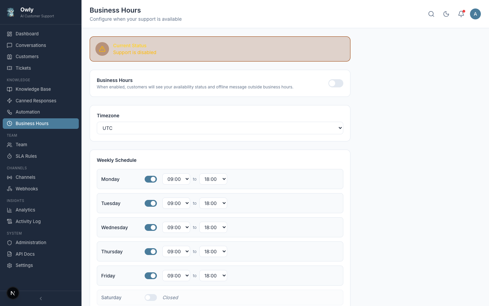
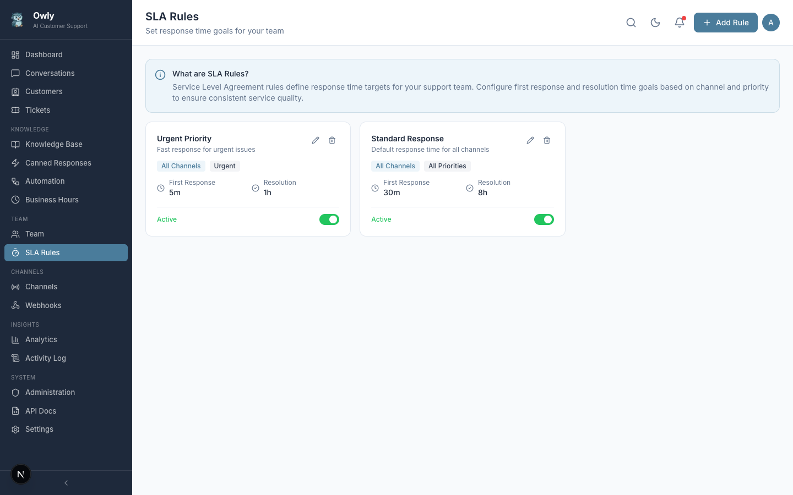

# Business Hours and SLA

Business Hours and SLA (Service Level Agreement) rules work together to define when your support team is available and how quickly customers should expect responses. These settings help manage customer expectations and measure your team's performance.

---

## Business Hours

Business hours define your weekly availability schedule. When business hours are enabled, Owly can automatically send offline messages to customers who contact you outside of your schedule.

*The Business Hours configuration page showing the weekly schedule with time ranges, timezone selection, and offline message.*

### Setting Up Business Hours

1. Navigate to **Business Hours** in the sidebar
2. Toggle the **Enabled** switch to activate business hours
3. Configure the following settings:

#### Timezone

Select your business timezone from the dropdown. All business hour times are interpreted in this timezone.

> **Important:** Make sure the timezone matches your actual operating location. If your team is distributed across time zones, choose the timezone of your primary support center.

#### Weekly Schedule

For each day of the week, set the operating hours:

| Day | Format | Example | Meaning |
|-----|--------|---------|---------|
| Monday | `HH:MM-HH:MM` | `09:00-18:00` | Open from 9 AM to 6 PM |
| Tuesday | `HH:MM-HH:MM` | `09:00-18:00` | Open from 9 AM to 6 PM |
| Wednesday | `HH:MM-HH:MM` | `09:00-18:00` | Open from 9 AM to 6 PM |
| Thursday | `HH:MM-HH:MM` | `09:00-18:00` | Open from 9 AM to 6 PM |
| Friday | `HH:MM-HH:MM` | `09:00-17:00` | Open from 9 AM to 5 PM |
| Saturday | (empty) | | Closed |
| Sunday | (empty) | | Closed |

To mark a day as closed, leave the field empty.

#### Offline Message

Configure the message that customers receive when they contact you outside of business hours:

**Default:** "We are currently offline. We will get back to you during business hours."

You can customize this message to include:
- Your next opening time
- Alternative contact methods for emergencies
- A link to your FAQ or knowledge base

### What Happens Outside Business Hours

When a customer sends a message outside of your configured business hours:

1. The conversation is created normally in the system
2. The AI may still respond (depending on your configuration)
3. The offline message is sent to set expectations about response times
4. The conversation appears in your inbox for handling when you return

> **Note:** The AI continues to work 24/7 regardless of business hours settings. Business hours primarily affect the offline message and SLA tracking.

---

## SLA Rules

SLA rules define response time targets for your support team. They help you measure and maintain consistent service quality.

*The SLA Rules page showing rules with first response time targets, resolution time targets, and channel/priority filters.*

### Creating an SLA Rule

1. Navigate to **SLA Rules** in the sidebar
2. Click **Add SLA Rule**
3. Configure the rule:

| Field | Description | Example |
|-------|-------------|---------|
| Name | A descriptive name for the rule | "Standard Email SLA" |
| Description | What this rule covers | "Default response targets for email inquiries" |
| Channel | Which channel this rule applies to | `all`, `whatsapp`, `email`, or `phone` |
| Priority | Which ticket priority this rule applies to | `all`, `low`, `medium`, `high`, or `urgent` |
| First Response (minutes) | Target time to first reply | `30` (30 minutes) |
| Resolution (minutes) | Target time to resolve the issue | `480` (8 hours) |
| Active | Whether this rule is currently enforced | On or Off |

4. Click **Save**

### Channel-Specific SLAs

You can create different SLA targets for different channels, reflecting the varying urgency expectations of each:

| Channel | Typical First Response | Typical Resolution | Rationale |
|---------|----------------------|-------------------|-----------|
| WhatsApp | 5-15 minutes | 2-4 hours | Customers expect fast chat responses |
| Email | 30-60 minutes | 8-24 hours | Email is inherently less urgent |
| Phone | Immediate (real-time) | 1-2 hours | Phone calls are handled live |

### Priority-Specific SLAs

You can also set different targets based on ticket priority:

| Priority | Recommended First Response | Recommended Resolution |
|----------|---------------------------|----------------------|
| Urgent | 5 minutes | 1 hour |
| High | 15 minutes | 4 hours |
| Medium | 30 minutes | 8 hours |
| Low | 60 minutes | 24 hours |

### Combined SLAs

You can combine channel and priority filters for granular control. For example:
- "WhatsApp Urgent" -- First response in 5 minutes, resolution in 30 minutes
- "Email Low" -- First response in 2 hours, resolution in 48 hours

If a conversation matches multiple SLA rules, the most specific rule takes precedence (a rule targeting "whatsapp + urgent" wins over a rule targeting "all + all").

### How SLA Tracking Works

SLA tracking measures two key metrics for each conversation:

**First Response Time:**
- Starts when the customer sends their first message
- Stops when the first reply is sent (either by the AI or an admin)
- If the AI is enabled, this is typically very fast (seconds)

**Resolution Time:**
- Starts when the conversation is created
- Stops when the conversation status changes to "resolved" or "closed"
- Pauses during non-business hours (if business hours are enabled)

You can monitor SLA compliance in the [Analytics](Analytics-and-Reports) page, which shows average response times and resolution rates.

---

## Recommended Setup

For a typical small business, we recommend starting with these rules:

| Rule Name | Channel | Priority | First Response | Resolution |
|-----------|---------|----------|---------------|------------|
| Default SLA | All | All | 30 min | 480 min (8h) |
| Urgent Override | All | Urgent | 5 min | 60 min (1h) |
| WhatsApp Fast Response | WhatsApp | All | 10 min | 240 min (4h) |

You can always add more specific rules as your support operation grows.

---

## Next Steps

- [Automation Rules](Automation-Rules) -- Set up automatic routing that works within your SLA targets
- [Analytics and Reports](Analytics-and-Reports) -- Monitor SLA compliance and response times
- [Team and Departments](Team-and-Departments) -- Ensure you have enough team members to meet your SLA targets
