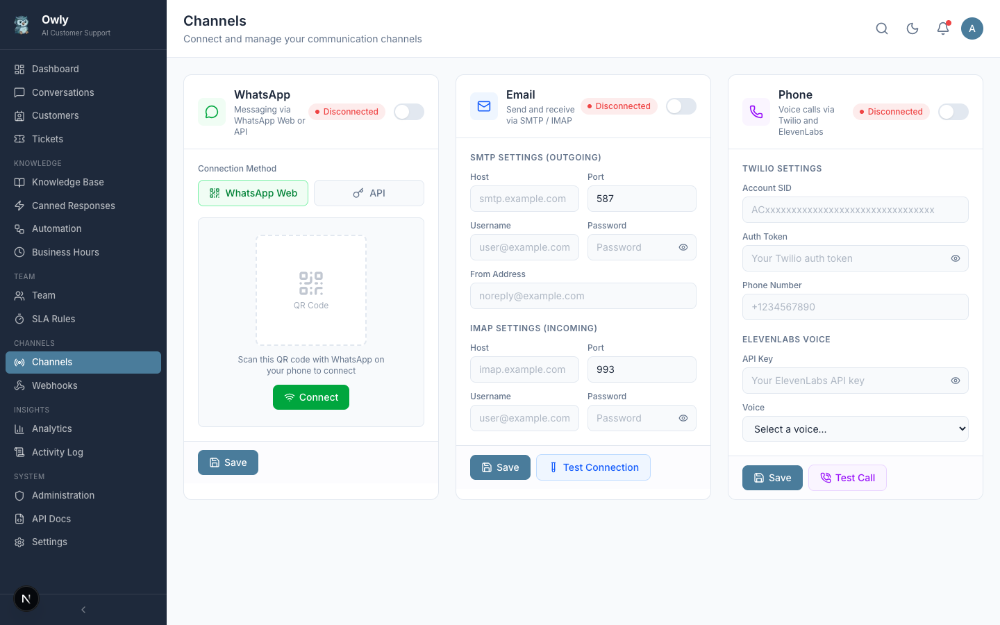

# Channel Setup

Channels are the communication pathways through which customers contact your business. Owly supports three channels: WhatsApp, Email, and Phone. Each channel can be configured independently from the Channels page.

*The Channels page showing WhatsApp, Email, and Phone channel cards with their connection status and configuration options.*

---

## Channel Status Indicators

Each channel displays a status indicator showing its current connection state:

| Status | Meaning |
|--------|---------|
| **Connected** | The channel is active and processing messages |
| **Disconnected** | The channel is not connected or has lost connection |
| **Connecting** | The channel is in the process of establishing a connection |
| **Error** | The channel encountered a configuration or connection error |

---

## WhatsApp Setup

Owly supports two methods for connecting WhatsApp:

### Method 1: QR Code (WhatsApp Web)

This is the simplest method and works with any personal or business WhatsApp account.

**Step 1:** Navigate to **Channels** in the sidebar

**Step 2:** Find the WhatsApp card and click **Configure**

**Step 3:** Select **Web (QR Code)** as the connection mode

**Step 4:** A QR code will be displayed on screen

**Step 5:** On your phone:
1. Open WhatsApp
2. Go to Settings (or tap the three dots menu)
3. Select **Linked Devices**
4. Tap **Link a Device**
5. Point your phone's camera at the QR code on screen

**Step 6:** Wait for the connection to establish. The status should change to "Connected" within a few seconds.

> **Important:** The WhatsApp Web connection requires the phone to stay connected to the internet. If the phone goes offline or the WhatsApp session is logged out, the connection will drop and you will need to scan the QR code again.

> **Note:** When running with Docker, WhatsApp authentication is persisted in the `whatsapp_auth` volume, so you do not need to re-scan after container restarts.

### Method 2: WhatsApp Business API

For businesses that need a more robust connection, you can use the WhatsApp Business API.

**Step 1:** Navigate to **Channels** in the sidebar

**Step 2:** Find the WhatsApp card and click **Configure**

**Step 3:** Select **API** as the connection mode

**Step 4:** Enter your WhatsApp Business API credentials:

| Field | Description |
|-------|-------------|
| API Key | Your WhatsApp Business API key |
| Phone Number | The business phone number registered with the API |

**Step 5:** Save the configuration

> **Note:** The WhatsApp Business API requires a separate account with Meta. Visit the Meta for Developers portal to set up a WhatsApp Business account.

---

## Email Setup

Email integration uses SMTP for sending replies and IMAP for receiving incoming messages.

### Configuring SMTP (Outgoing Email)

SMTP is used to send email replies to customers.

1. Navigate to **Settings** in the sidebar
2. Click the **Email** tab
3. Enter your SMTP configuration:

| Field | Description | Example |
|-------|-------------|---------|
| SMTP Host | Your email server hostname | `smtp.gmail.com` |
| SMTP Port | The server port (587 for TLS, 465 for SSL) | `587` |
| SMTP User | Your email username (usually the full email address) | `support@yourcompany.com` |
| SMTP Password | Your email password or app-specific password | (your password) |
| From Address | The "From" address shown to recipients | `support@yourcompany.com` |

4. Click **Save**

### Configuring IMAP (Incoming Email)

IMAP is used to receive and process incoming customer emails.

1. In the same **Email** settings tab, configure the IMAP section:

| Field | Description | Example |
|-------|-------------|---------|
| IMAP Host | Your email server hostname | `imap.gmail.com` |
| IMAP Port | The server port (993 for SSL) | `993` |
| IMAP User | Your email username | `support@yourcompany.com` |
| IMAP Password | Your email password or app-specific password | (your password) |

2. Click **Save**

### Testing the Email Connection

After configuring both SMTP and IMAP:
1. Go to the **Channels** page
2. Find the Email card
3. Use the test function to verify the connection

### Gmail-Specific Setup

If you are using Gmail:

1. Enable 2-Factor Authentication on your Google account
2. Generate an App Password: Google Account > Security > 2-Step Verification > App Passwords
3. Use the app password (not your regular Gmail password) for both SMTP and IMAP passwords
4. SMTP settings: Host `smtp.gmail.com`, Port `587`
5. IMAP settings: Host `imap.gmail.com`, Port `993`

> **Warning:** Do not use your primary Gmail password. Always use an app-specific password for security.

---

## Phone Setup

Phone support uses Twilio for call handling, OpenAI Whisper for speech-to-text, and ElevenLabs for text-to-speech.

### Prerequisites

Before configuring phone support, you will need:

| Service | What You Need | Where to Get It |
|---------|---------------|-----------------|
| Twilio | Account SID, Auth Token, Phone Number | [twilio.com](https://www.twilio.com) |
| ElevenLabs | API Key, Voice ID | [elevenlabs.io](https://elevenlabs.io) |
| OpenAI | API Key (for Whisper STT) | Already configured if AI is set up |

### Step 1: Configure Twilio

1. Navigate to **Settings** in the sidebar
2. Click the **Phone** tab
3. Enter your Twilio credentials:

| Field | Description |
|-------|-------------|
| Twilio Account SID | Found in your Twilio Console dashboard |
| Twilio Auth Token | Found in your Twilio Console dashboard |
| Twilio Phone Number | The phone number you purchased from Twilio (in +E.164 format, e.g., `+15551234567`) |

4. Click **Save**

### Step 2: Configure ElevenLabs Voice

1. Click the **Voice** tab in Settings
2. Enter your ElevenLabs configuration:

| Field | Description |
|-------|-------------|
| ElevenLabs API Key | Your API key from the ElevenLabs dashboard |
| Voice ID | The ID of the voice you want Owly to use when speaking |

3. Click **Save**

> **Tip:** ElevenLabs offers several pre-made voices. Visit their voice library to find one that matches your brand's personality. You can also clone a custom voice.

### Step 3: Configure Twilio Webhook

For incoming calls to reach Owly, configure your Twilio phone number's webhook:

1. Go to your Twilio Console
2. Navigate to Phone Numbers > Manage > Active Numbers
3. Click on your phone number
4. Under "Voice & Fax", set the webhook URL to: `https://your-owly-domain.com/api/channels/phone/incoming`
5. Set the HTTP method to `POST`
6. Save the configuration

> **Important:** Phone support requires Owly to be accessible from the internet (not just localhost). You will need a public URL or a tunnel service like ngrok for development.

---

## Troubleshooting Channel Connections

### WhatsApp: QR code not appearing

- Ensure the application is running and accessible
- Refresh the page and try again
- Check the server logs for WhatsApp-related errors

### WhatsApp: Connection drops frequently

- Ensure the phone linked to WhatsApp maintains a stable internet connection
- Check that WhatsApp is not logged out of the linked device
- For Docker deployments, verify the `whatsapp_auth` volume is properly mounted

### Email: Cannot send messages

- Verify SMTP credentials are correct
- Check that the SMTP port matches your server's requirements (587 for TLS, 465 for SSL)
- For Gmail, ensure you are using an App Password
- Check if your email provider blocks "less secure apps"

### Email: Not receiving messages

- Verify IMAP credentials are correct
- Check that IMAP port is 993 (SSL)
- Ensure IMAP is enabled in your email provider settings
- For Gmail, enable IMAP in Gmail Settings > Forwarding and POP/IMAP

### Phone: Calls not connecting

- Verify Twilio credentials (Account SID and Auth Token)
- Check that the Twilio phone number is active and correctly formatted
- Ensure the webhook URL is publicly accessible
- Check Twilio's call logs for error messages

---

## Next Steps

- [Conversations and Inbox](Conversations-and-Inbox) -- See messages flowing in from connected channels
- [Business Hours and SLA](Business-Hours-and-SLA) -- Set up schedules for when channels are monitored
- [Automation Rules](Automation-Rules) -- Create rules that trigger based on channel type
