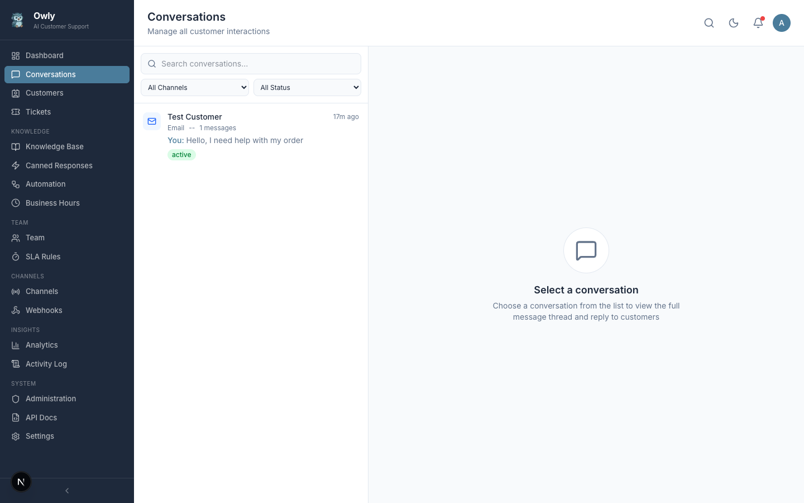

# Conversations

The Conversations page is the operational heart of Owly. It provides a unified inbox where every customer interaction -- whether it arrives via WhatsApp, Email, Phone, or the REST API -- is consolidated into a single, manageable view. From here, administrators monitor AI responses, intervene when necessary, manage conversation lifecycles, apply tags, leave internal notes, and track customer satisfaction.


*The unified inbox displaying conversations from all channels with status indicators, channel badges, and message previews.*

---

## Table of Contents

- [Unified Inbox Concept](#unified-inbox-concept)
- [Left Panel: Conversation List](#left-panel-conversation-list)
- [Right Panel: Conversation Detail](#right-panel-conversation-detail)
- [Admin Takeover](#admin-takeover)
- [Status Management](#status-management)
- [Conversation Tags](#conversation-tags)
- [Internal Notes](#internal-notes)
- [Satisfaction Rating Widget](#satisfaction-rating-widget)
- [Practical Tips](#practical-tips)

---

## Unified Inbox Concept

Traditional support setups require switching between different tools for each communication channel. Owly eliminates this fragmentation by routing every inbound message -- regardless of its origin -- into a single inbox.

When a customer sends a WhatsApp message, an email, makes a phone call, or submits a request through the API, a conversation is created (or an existing one is continued) in the same unified view. This means:

- **No context switching.** You do not need separate dashboards for WhatsApp, email, and phone.
- **Full visibility.** Every conversation is visible in one place, making it impossible for a message to be missed.
- **Consistent workflow.** The same filtering, tagging, and status management tools apply to all channels.
- **AI coverage across channels.** The AI agent handles conversations from all channels using the same knowledge base and logic.

Each conversation in the inbox is identified by the customer name, the channel it originated from, the most recent message snippet, the timestamp of the last activity, and the current status.

---

## Left Panel: Conversation List

The left panel displays a scrollable list of all conversations. Each entry shows a summary of the conversation at a glance.

### Conversation List Elements

| Element | Description |
|---------|-------------|
| Customer Name | The name of the customer. Displays "Unknown" if the customer has not been identified yet. |
| Channel Badge | A visual indicator showing which channel the conversation originated from (WhatsApp, Email, Phone, or API). |
| Message Preview | A truncated snippet of the most recent message in the thread. |
| Timestamp | The date and time of the last message sent or received. |
| Status Indicator | The current lifecycle status of the conversation (active, resolved, escalated, or closed). |

### Filtering by Channel

The channel filter at the top of the conversation list lets you isolate conversations by their source:

| Filter | Shows |
|--------|-------|
| **All** | Every conversation, regardless of channel |
| **WhatsApp** | Only conversations from WhatsApp |
| **Email** | Only conversations from email |
| **Phone** | Only conversations from phone calls |
| **API** | Only conversations initiated through the REST API |

This is useful when you need to focus on a specific channel -- for example, reviewing all email conversations during an outage or monitoring WhatsApp traffic during a marketing campaign.

### Filtering by Status

You can narrow the conversation list to show only conversations in a particular lifecycle stage:

| Filter | Shows |
|--------|-------|
| **All** | Conversations in any status |
| **Active** | Ongoing conversations that still require attention |
| **Resolved** | Conversations where the issue has been addressed |
| **Escalated** | Conversations flagged for human intervention |
| **Closed** | Finalized conversations with no pending actions |

### Search

The search bar at the top of the list allows free-text search across:

- Customer name
- Customer contact information (email, phone number, WhatsApp number)
- Message content within conversations

Results update as you type, making it quick to locate a specific conversation even in a large inbox.

---

## Right Panel: Conversation Detail

Clicking on any conversation in the left panel opens its full detail view in the right panel. This view provides the complete message thread, customer information, and management controls.

### Customer Info Header

At the top of the detail view, a header displays:

- **Customer name** and primary contact information
- **Channel** the conversation is on (with a visual badge)
- **Current status** of the conversation
- **Satisfaction rating** (if the customer has provided one)
- **Tags** applied to the conversation
- **Linked tickets** (if any tickets have been created from this conversation)

### Message Thread

The message thread shows the complete chronological history of the conversation. Each message is attributed to its sender with a clear visual distinction:

| Message Type | Description |
|--------------|-------------|
| **Customer messages** | Messages sent by the customer through the channel |
| **AI responses** | Automated replies generated by Owly's AI agent based on your knowledge base |
| **Admin messages** | Messages sent manually by an administrator (you or a team member) |
| **Tool calls** | Actions the AI performed during the conversation, such as creating a ticket, looking up customer history, or triggering a webhook |

Tool calls are displayed inline in the thread so you can see exactly what the AI did and why. For example, if the AI created a ticket, you will see the tool call with the ticket title, description, and priority it chose.

---

## Admin Takeover

While the AI handles the majority of conversations automatically, there are situations where human intervention is necessary. Owly makes it straightforward to step in at any point.

### How to Take Over a Conversation

1. Open the conversation from the inbox by clicking on it in the left panel.
2. Read through the message thread to understand the context.
3. Type your response in the reply input at the bottom of the conversation detail.
4. Send the message.

Your message is delivered to the customer through the same channel the conversation originated on. If the customer initially wrote via WhatsApp, your reply goes out as a WhatsApp message. If they emailed, your reply is sent as an email.

### What Happens After Takeover

When you send a message as an admin, the AI sees your message in the conversation history. This is important because:

- The AI will not contradict what you have said to the customer.
- The AI can incorporate your response as context for any follow-up messages it generates.
- If the customer responds again and the AI is still active, it will continue the conversation with awareness of your intervention.

### When to Take Over

Consider taking over a conversation in these situations:

- **Incorrect AI response.** The AI provided an answer that is factually wrong or incomplete. Step in to correct it.
- **Customer requests a human.** Some customers prefer speaking with a person. Respect this by responding directly.
- **Sensitive or complex issue.** Billing disputes, complaints, legal matters, or situations requiring empathy are often better handled by a human.
- **VIP customer.** High-value customers may warrant personal attention regardless of the AI's capabilities.
- **Escalated conversation.** If a conversation has been escalated (by the AI or by an automation rule), it is waiting for human attention.

> **Tip:** After taking over, consider whether the AI's knowledge base needs updating. If the AI gave an incorrect answer, the relevant knowledge entry may be missing, outdated, or insufficiently prioritized.

---

## Status Management

Every conversation follows a defined lifecycle with four statuses. Managing these statuses correctly keeps your inbox organized and ensures no conversation is overlooked.

### Status Definitions

| Status | Meaning | Typical Use |
|--------|---------|-------------|
| **Active** | The conversation is ongoing. The customer may still be waiting for a response, or the issue has not yet been resolved. | Default status for new and in-progress conversations. |
| **Resolved** | The issue has been addressed. The customer's question was answered or their problem was fixed. | Set manually by an admin or automatically when the AI determines the issue is resolved. |
| **Escalated** | The conversation requires human attention. The AI could not resolve the issue, or the customer requested a human agent. | Set by the AI, by automation rules, or manually by an admin. |
| **Closed** | The conversation is finalized. No further action is expected. | Set manually after confirming the resolution is satisfactory. |

### Status Flow

```
active --> resolved --> closed
  |
  +--> escalated --> resolved --> closed
```

A conversation can move backward in the lifecycle. For example, if a customer replies to a resolved conversation, it can be set back to active. Similarly, a closed conversation can be reopened if the customer follows up.

### Changing Status

To change a conversation's status:

1. Open the conversation detail.
2. Locate the status selector (typically a dropdown or button group).
3. Select the new status.
4. The change is applied immediately.

### Best Practices for Status Management

- **Mark conversations as resolved promptly.** This keeps the active count accurate and helps you focus on conversations that truly need attention.
- **Use escalated status deliberately.** Reserve it for conversations that genuinely require human intervention, not just difficult questions the AI might answer with better knowledge base entries.
- **Close resolved conversations after a reasonable period.** If a customer has not responded within a few days of resolution, it is safe to close the conversation.
- **Review active conversations regularly.** An aging active conversation may indicate a customer who is still waiting for help.

---

## Conversation Tags

Tags are color-coded labels that you can apply to conversations for categorization, filtering, and organization.

### How Tags Work

Each tag in Owly has two properties:

| Property | Description |
|----------|-------------|
| **Name** | A descriptive label (e.g., "billing", "technical", "feedback", "urgent") |
| **Color** | A hex color code for visual identification in the inbox |

Tags are managed globally (created once, used across any conversation) and linked to conversations through a many-to-many relationship. A single conversation can have multiple tags, and a single tag can be applied to many conversations.

### Applying Tags

1. Open the conversation detail.
2. Locate the tags section.
3. Add one or more tags to the conversation.

### Practical Uses for Tags

| Tag Example | Purpose |
|-------------|---------|
| `billing` | Categorize conversations related to payments, invoices, and subscriptions |
| `technical` | Mark conversations involving technical issues or product bugs |
| `feedback` | Identify conversations where the customer provided product feedback |
| `follow-up` | Flag conversations that need a follow-up action at a later date |
| `vip` | Highlight conversations from high-value customers |
| `refund-request` | Track conversations involving refund or return requests |

> **Tip:** Keep your tag vocabulary consistent across the team. Agree on a standard set of tags and their definitions to avoid confusion. Too many tags with overlapping meanings reduce their usefulness.

---

## Internal Notes

Internal notes are private annotations that administrators can attach to a conversation. They are visible only within the admin panel and are never sent to the customer.

### Adding an Internal Note

1. Open the conversation detail.
2. Switch to the notes tab or locate the internal notes section.
3. Type the note content.
4. Click **Add Note**.

Each note automatically records the author name and timestamp.

### Key Characteristics

- **Private.** Internal notes are stored separately from the message thread and are invisible to the customer.
- **Persistent.** Notes remain attached to the conversation permanently (unless manually deleted).
- **Attributed.** Each note shows who wrote it and when, creating an audit trail.

### When to Use Internal Notes

| Scenario | Example Note |
|----------|--------------|
| Documenting context the AI does not know | "Customer was promised a 20% discount during their last phone call with sales." |
| Leaving instructions for another team member | "Follow up on Monday regarding the replacement shipment. Tracking number pending." |
| Recording a decision | "Approved exception to 30-day return policy due to shipping delay on our end." |
| Flagging for review | "Verify this customer's account status before processing the refund." |
| Noting AI behavior | "AI recommended wrong product model. KB entry for Model X needs to be updated." |

> **Tip:** Use internal notes to bridge the gap between what the AI knows (from the knowledge base) and what requires human judgment. If you find yourself writing the same type of note repeatedly, consider updating your knowledge base or creating an automation rule instead.

---

## Satisfaction Rating Widget

Owly includes a built-in customer satisfaction tracking system. Customers can rate their support experience on a scale of 1 to 5 stars.

### How It Works

- The satisfaction rating is stored as an integer value (1 through 5) on each conversation.
- The rating is captured when the customer provides feedback through the conversation channel.
- You can view individual conversation ratings directly in the conversation detail header.
- Aggregate satisfaction metrics are available on the [Analytics](Analytics-and-Reports) page, where you can track trends over time.

### Interpreting Satisfaction Data

| Rating | Interpretation |
|--------|----------------|
| 5 | Excellent -- the customer is fully satisfied |
| 4 | Good -- the customer is generally satisfied with minor reservations |
| 3 | Neutral -- the experience was acceptable but not exceptional |
| 2 | Poor -- the customer is dissatisfied with parts of the experience |
| 1 | Very poor -- the customer is highly dissatisfied |

### Using Satisfaction Data to Improve

- **Review low-rated conversations.** Examine what went wrong -- was it an incorrect AI response, a slow resolution, or a process issue?
- **Identify patterns.** If a particular topic consistently receives low ratings, the knowledge base entry for that topic may need improvement.
- **Track improvement over time.** After updating your knowledge base or processes, monitor whether satisfaction scores improve.
- **Benchmark your team.** Compare AI-handled conversations with admin-handled ones to understand where each excels.

---

## Practical Tips

1. **Check the inbox at regular intervals.** Even though the AI handles most conversations, a brief review ensures nothing has been missed or mishandled.

2. **Use filters strategically.** Start your day by filtering for escalated conversations, then review active ones, and finally check resolved ones for quality.

3. **Combine tags with status filters.** For example, filter by "active" status and "billing" tag to see all open billing-related conversations.

4. **Keep the AI informed.** When you take over a conversation and discover the AI lacked certain information, update the knowledge base immediately so the AI handles similar questions correctly in the future.

5. **Use internal notes liberally.** They cost nothing and provide valuable context for anyone who reviews the conversation later, including your future self.

6. **Close old conversations.** Periodically review resolved conversations that have been idle for several days and close them. This keeps the active and resolved views clean and focused.

---

## Related Pages

- [Customers](Customers) -- View and manage customer profiles linked to conversations
- [Tickets](Tickets) -- Track issues that arise from conversations
- [Knowledge Base](Knowledge-Base) -- Manage the information the AI uses to respond
- [Canned Responses](Canned-Responses) -- Use pre-written templates when replying to customers
