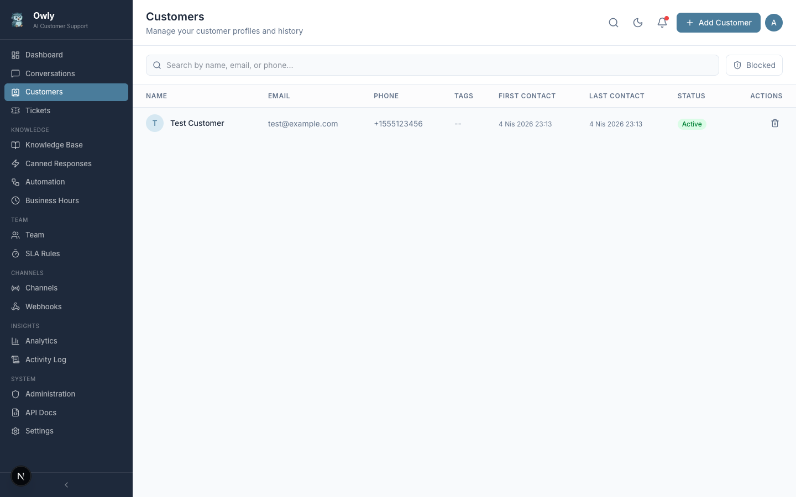

# Customers

The Customers page is Owly's built-in CRM (Customer Relationship Management) system. It provides a centralized directory of every customer who has interacted with your business, along with their contact details, conversation history across all channels, tags for categorization, and internal notes for long-term context.

*The Customer Management page showing customer profiles with contact information, tags, block status, and action buttons.*

---

## Table of Contents

- [Customer Profiles](#customer-profiles)
- [Automatic Customer Creation](#automatic-customer-creation)
- [Tags](#tags)
- [Customer Notes](#customer-notes)
- [Conversation History](#conversation-history)
- [Blocking and Unblocking Customers](#blocking-and-unblocking-customers)
- [Search and Filtering](#search-and-filtering)
- [Practical Tips](#practical-tips)

---

## Customer Profiles

Each customer in Owly has a profile containing the following fields:

| Field | Description | Required |
|-------|-------------|----------|
| **Name** | The customer's full name | Yes |
| **Email** | Email address | No |
| **Phone** | Phone number | No |
| **WhatsApp** | WhatsApp number | No |
| **Tags** | Comma-separated labels for categorization | No |
| **Blocked** | Whether the customer is blocked from contacting support | No (default: false) |
| **First Contact** | Timestamp of the customer's first interaction | Auto-set |
| **Last Contact** | Timestamp of the customer's most recent interaction | Auto-set |
| **Metadata** | Additional structured data stored as JSON | No |

A single customer may have contact information across multiple channels. Owly consolidates all of their interactions -- WhatsApp messages, emails, phone calls, and API requests -- into one unified profile.

### Adding a Customer Manually

1. Navigate to **Customers** in the sidebar.
2. Click **Add Customer**.
3. Fill in the customer information. At minimum, a name is required.
4. Add any relevant tags (comma-separated).
5. Click **Save**.

### Editing a Customer Profile

1. Locate the customer in the list (use search if needed).
2. Click on their profile or the edit button.
3. Update any fields as needed.
4. Click **Save**.

Changes to customer profiles take effect immediately. The AI will use updated contact information for any future matching.

---

## Automatic Customer Creation

Customers are created automatically when they contact your business through any channel. You do not need to manually register every customer before they can interact with your support system.

### How Automatic Creation Works

1. A new message arrives through WhatsApp, Email, Phone, or the API.
2. Owly extracts the sender's contact information (phone number, email address, or WhatsApp number).
3. The system searches existing customer profiles for a match on any of the indexed contact fields (email, phone, or WhatsApp).
4. **If a match is found:** The existing customer profile is linked to the conversation, and the `lastContact` timestamp is updated.
5. **If no match is found:** A new customer profile is created with the available contact information. The name is set to "Unknown" if it cannot be determined from the channel.

### Practical Implications

- **No pre-registration required.** Customers can contact you without being in the system first.
- **Automatic deduplication.** If a customer emails from `john@example.com` and later messages via WhatsApp from the same number stored in their profile, both conversations are linked to the same customer.
- **Incomplete profiles are normal.** Automatically created customers may have only one contact field populated. You can fill in the remaining fields manually as you learn more about the customer.
- **"Unknown" customers.** When the channel does not provide a name (common with phone calls and some WhatsApp configurations), the customer name is set to "Unknown". Update it manually when you identify the customer.

> **Tip:** Periodically review customers with the name "Unknown" and update their profiles. This improves the AI's ability to provide personalized responses and makes the customer list more useful.

---

## Tags

Tags are text labels that help you categorize and segment your customer base. They are stored as comma-separated values on each customer profile.

### Adding Tags

1. Open the customer's profile for editing.
2. In the tags field, enter tags separated by commas.
3. Click **Save**.

Example: `vip, enterprise, spanish`

### Removing Tags

1. Open the customer's profile for editing.
2. Remove the unwanted tag from the comma-separated list.
3. Click **Save**.

### Tag Conventions

Establish consistent tag naming conventions across your team to maximize their usefulness:

| Tag | Use Case |
|-----|----------|
| `vip` | High-value customers who warrant priority treatment |
| `enterprise` | Business or corporate customers (as opposed to individual consumers) |
| `new` | Recently acquired customers (first interaction within the last 30 days) |
| `returning` | Repeat customers with multiple past interactions |
| `issue-open` | Customers with an unresolved issue or open ticket |
| `at-risk` | Customers who have expressed dissatisfaction or intent to leave |
| `spanish` / `french` / `german` | Language preference for communication |
| `do-not-call` | Customers who have opted out of phone contact |
| `referral-source` | Customers acquired through a referral program |

### Using Tags Effectively

- **Segment for outreach.** Use tags to identify customer segments for targeted communication.
- **Provide context to the team.** A tag like `vip` immediately signals to any team member that this customer deserves extra attention.
- **Track status over time.** Add and remove tags as the customer's situation changes (e.g., add `issue-open` when a ticket is created, remove it when resolved).
- **Keep the tag vocabulary small.** Too many tags with overlapping meanings reduce clarity. Aim for 10-20 standardized tags that cover your main categorization needs.

---

## Customer Notes

Customer notes are private annotations attached to a customer profile. Unlike conversation-level internal notes (which are tied to a specific conversation), customer notes persist across all conversations and serve as a long-term record of important information about the customer.

### Adding a Note

1. Open the customer's profile.
2. Navigate to the notes section.
3. Type the note content.
4. Click **Add Note**.

Each note automatically records:
- **Author name** -- The administrator who wrote the note (defaults to "Admin").
- **Timestamp** -- The exact date and time the note was created.

### Difference Between Customer Notes and Conversation Notes

| Feature | Customer Notes | Conversation Internal Notes |
|---------|---------------|----------------------------|
| **Scope** | Attached to the customer profile; visible across all conversations | Attached to a specific conversation only |
| **Persistence** | Permanent record for the customer | Tied to the lifecycle of the conversation |
| **Best for** | Long-term customer context, preferences, account history | Conversation-specific context, handoff instructions |
| **Example** | "Prefers email communication. Do not call." | "Customer is waiting for a callback from shipping department." |

### Use Cases for Customer Notes

| Scenario | Example Note |
|----------|--------------|
| Communication preferences | "Prefers email communication. Do not use phone under any circumstances." |
| Account history | "Upgraded from Basic to Premium plan on 2025-11-15. Received 3-month loyalty discount." |
| Special handling | "Requires manager approval for any refund exceeding $200." |
| Known issues | "Has had recurring login problems since the platform migration in January." |
| Follow-up tracking | "Promised a callback within 48 hours regarding order #4521. Deadline: March 20." |
| Relationship context | "Referred by existing customer Sarah Chen. Part of the Q1 referral campaign." |

> **Tip:** Customer notes are especially valuable for information that the AI cannot access directly. When a team member reads a customer note before responding, they have context that prevents the customer from having to repeat themselves.

---

## Conversation History

One of the most powerful features of Owly's customer management is the ability to view a customer's complete conversation history across all channels in a single view.

### What the History Shows

When you open a customer profile, you can see:

| Information | Description |
|-------------|-------------|
| **All conversations** | Every conversation the customer has had, regardless of channel |
| **Channel identification** | Which channel was used for each conversation (WhatsApp, Email, Phone, or API) |
| **Status** | The current status of each conversation (active, resolved, escalated, closed) |
| **Linked tickets** | Any tickets that were created from the customer's conversations |
| **Timestamps** | When each conversation started and when the last message was exchanged |

### Cross-Channel Context

This unified history is critical for delivering consistent support. Consider this scenario:

1. A customer emails about a defective product on Monday.
2. The AI creates a ticket and promises a replacement.
3. On Wednesday, the same customer sends a WhatsApp message asking about the status.

Because Owly links both conversations to the same customer profile, you (and the AI, using the `get_customer_history` tool) can see the full context. The AI knows about the Monday email and the pending ticket, so it can provide an informed status update instead of treating the WhatsApp message as a brand-new inquiry.

### How the AI Uses Customer History

During a conversation, the AI can invoke the `get_customer_history` tool to look up a customer's previous interactions. This enables the AI to:

- Reference previous conversations and their outcomes.
- Acknowledge unresolved issues from earlier interactions.
- Avoid asking the customer to repeat information they have already provided.
- Provide more personalized, context-aware responses.

---

## Blocking and Unblocking Customers

If a customer sends abusive messages, spam, or otherwise needs to be restricted, you can block them.

### Blocking a Customer

1. Open the customer's profile.
2. Click the **Block** button.
3. Confirm the action.

### What Happens When a Customer Is Blocked

- The customer's profile is marked with a visible blocked indicator in the customer list.
- The `isBlocked` field is set to `true`.
- Depending on your system configuration, blocked customers may be prevented from initiating new conversations or their messages may be flagged for review.

### Unblocking a Customer

1. Open the blocked customer's profile.
2. Click the **Unblock** button.
3. Confirm the action.

The block is removed immediately and the customer can resume normal interactions.

### When to Block a Customer

- **Abusive behavior.** Repeated threatening, harassing, or vulgar messages.
- **Spam.** Customers sending unsolicited promotional content or automated messages.
- **Fraud.** Customers identified as engaging in fraudulent activity.
- **Duplicate accounts.** Block the duplicate profile and keep the primary one active.

> **Tip:** Before blocking, consider leaving a customer note documenting the reason. This provides context for any team member who encounters the blocked profile later.

---

## Search and Filtering

The Customers page provides a search bar for quickly locating specific customers.

### Search Fields

You can search by any of the following:

| Field | Example Search |
|-------|---------------|
| Customer name | "John Smith" |
| Email address | "john@example.com" |
| Phone number | "+1-555-0123" |
| WhatsApp number | "+1-555-0456" |

Search results update as you type, providing instant results even with partial input.

### Locating Customers Efficiently

- **Search by contact info when you have it.** Phone numbers and email addresses are unique identifiers and produce the most precise results.
- **Search by name when contact info is unavailable.** Be aware that name searches may return multiple results for common names.
- **Use partial matches.** Typing "john" will surface all customers whose name, email, or phone contains "john".

---

## Practical Tips

1. **Merge duplicate profiles promptly.** When you discover that the same person has two customer profiles (e.g., one created from email and another from WhatsApp), consolidate them by updating one profile with all contact information and removing the other.

2. **Keep profiles up to date.** When a customer provides new contact information during a conversation, update their profile immediately. This ensures future messages from the new channel are correctly linked.

3. **Use tags consistently across the team.** Agree on a standard set of tags and their definitions. Document them so every team member applies tags the same way.

4. **Add notes proactively.** After a significant interaction, leave a customer note summarizing the outcome. Your future self and your teammates will thank you.

5. **Review "Unknown" customers regularly.** Automatically created profiles often have incomplete information. Filling in names and additional contact details improves the overall quality of your customer database.

6. **Leverage the AI's history lookup.** The AI uses `get_customer_history` to provide context-aware support. The more complete your customer profiles and conversation records are, the better the AI performs.

---

## Related Pages

- [Conversations](Conversations) -- View and manage conversations linked to customers
- [Tickets](Tickets) -- Track customer issues as tickets
- [Team and Departments](Team-and-Departments) -- Set up team members who handle customer interactions
- [Knowledge Base](Knowledge-Base) -- Manage the information the AI uses to respond
