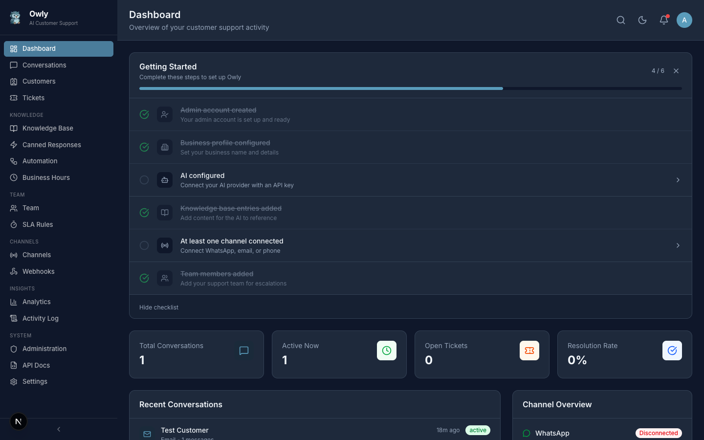

# Dashboard Overview

The dashboard is the first page you see after logging in. It provides a real-time overview of your customer support operations and serves as the central hub for navigating all of Owly's features.

*The Owly dashboard showing the onboarding checklist, stat cards, recent conversations, and channel overview.*

---

## Dashboard Sections

### Onboarding Checklist

At the top of the dashboard, you will find an onboarding checklist that tracks your setup progress. This helps ensure you have configured all the essential features before going live.

The checklist includes steps such as:
- Creating your admin account (completed during setup)
- Configuring your business profile
- Setting up your AI provider
- Adding knowledge base entries
- Connecting at least one channel (WhatsApp, Email, or Phone)
- Adding team members

Each completed step is marked with a checkmark. The progress indicator (for example, "4/6 steps complete") shows how far along you are. Once all steps are done, the checklist automatically hides.

> **Tip:** Follow the onboarding checklist in order. It guides you through the most important configuration steps to get your AI support agent running quickly.

### Stat Cards

Below the checklist, you will see a row of stat cards that summarize your current support metrics:

| Card | Description |
|------|-------------|
| Active Conversations | Number of conversations currently in "active" status |
| Total Conversations | Total number of conversations across all time |
| Resolution Rate | Percentage of conversations that have been resolved or closed |
| Open Tickets | Number of tickets currently in "open" status |

These numbers update every time you load the dashboard.

### Recent Conversations

A list of your most recent customer conversations across all channels. Each entry shows:

- Customer name
- Channel (WhatsApp, Email, Phone, or API)
- A preview of the last message
- Timestamp of the last activity
- Current status (active, resolved, escalated, or closed)

Click on any conversation to open it in the full conversation view.

### Channel Overview

A summary of your connected channels and their current status. This section shows:

- Which channels are active or disconnected
- The number of conversations per channel
- Quick access to channel configuration

### Quick Stats

Additional metrics that give you a snapshot of your support operations, including conversation trends and team activity.

---

## Sidebar Navigation

The sidebar on the left is your primary navigation tool. It is organized into logical sections and can be collapsed for more screen space.

### Main Section

| Item | Description |
|------|-------------|
| Dashboard | The overview page (this page) |
| Conversations | Unified inbox for all customer messages |
| Customers | Customer profiles and CRM |
| Tickets | Issue tracking and resolution |

### Knowledge Section

| Item | Description |
|------|-------------|
| Knowledge Base | Manage AI knowledge categories and entries |
| Canned Responses | Pre-written reply templates |

### Operations Section

| Item | Description |
|------|-------------|
| Team | Departments and team members |
| Automation | Auto-routing, auto-tagging, and auto-reply rules |
| Business Hours | Weekly availability schedule |
| SLA Rules | Service level agreement targets |

### Channels Section

| Item | Description |
|------|-------------|
| Channels | Connect and manage WhatsApp, Email, and Phone |
| Webhooks | External service integrations |

### Admin Section

| Item | Description |
|------|-------------|
| Analytics | Performance charts and metrics |
| Activity Log | Full audit trail of system actions |
| Administration | Admin users and API keys |
| API Docs | Interactive API documentation |
| Settings | Application configuration (6 tabs) |

---

## Dark Mode

Owly includes a full dark theme that can be toggled with a single click.

*The dashboard in dark mode. All pages, components, and charts adapt to the dark theme.*

To toggle dark mode:

1. Look for the theme toggle icon in the top-right area of the header
2. Click the icon to switch between light and dark themes
3. Your preference is saved and persists across sessions

The dark theme applies to every page in the application, including charts, forms, tables, and modals.

---

## Next Steps

- [Conversations and Inbox](Conversations-and-Inbox) -- Start managing customer conversations
- [Knowledge Base Guide](Knowledge-Base-Guide) -- Add knowledge so the AI provides accurate answers
- [Channel Setup](Channel-Setup) -- Connect your first communication channel
