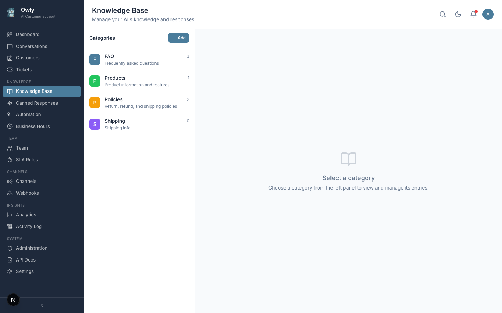
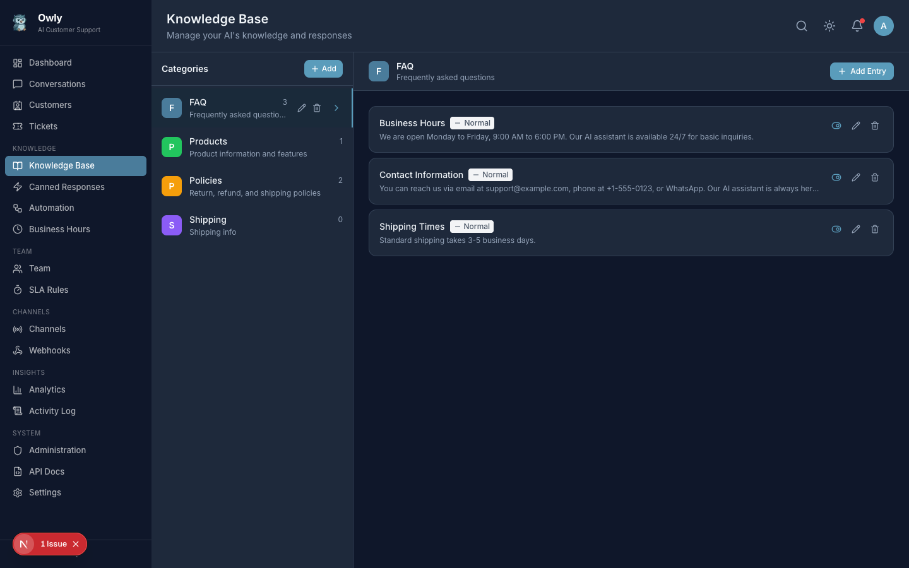

# Knowledge Base

The knowledge base is the foundation of your AI support agent. Every answer Owly gives to a customer is derived from the knowledge entries you create and maintain. A well-structured, accurately prioritized knowledge base directly translates to better, more reliable AI responses. A neglected one leads to incorrect answers, frustrated customers, and unnecessary escalations.


*The Knowledge Base page showing categories with entry counts, descriptions, and color-coded icons.*

---

## Table of Contents

- [How the AI Uses the Knowledge Base](#how-the-ai-uses-the-knowledge-base)
- [Managing Categories](#managing-categories)
- [Managing Knowledge Entries](#managing-knowledge-entries)
- [Priority Levels](#priority-levels)
- [Active and Inactive Entries](#active-and-inactive-entries)
- [KB Test Mode](#kb-test-mode)
- [Best Practices for Writing Effective Entries](#best-practices-for-writing-effective-entries)
- [Maintenance Tips](#maintenance-tips)

---

## How the AI Uses the Knowledge Base

Owly uses a method called **Retrieval-Augmented Generation (RAG)** to answer customer questions. Here is a plain-language explanation of what happens each time a customer sends a message:

1. **Customer sends a message.** The message arrives through any channel -- WhatsApp, Email, Phone, or the API.

2. **Owly retrieves knowledge entries.** The system loads all active knowledge base entries from the database.

3. **Entries are sorted by priority.** Higher-priority entries are given more prominence in the AI's context. This means a priority-9 entry about your refund policy will carry more weight than a priority-2 entry about office parking.

4. **The AI receives the knowledge base and the question.** The AI model is provided with your knowledge entries alongside the customer's message. Crucially, the AI is instructed to answer based on **your knowledge base content only** -- not from general internet knowledge.

5. **The AI generates a response.** Using the provided knowledge, the AI composes a reply that addresses the customer's question.

6. **Fallback behavior.** If the AI cannot find a relevant answer in the knowledge base, it honestly tells the customer it does not have that information and offers to connect them with a team member.

### Why This Matters

This architecture means the AI will never invent answers. It is constrained to the information you provide. This makes it safe to deploy in customer-facing scenarios because you control exactly what the AI can and cannot say. The quality of your knowledge base is the single most important factor in the quality of your AI support.

---

## Managing Categories

Categories are the top-level organizational structure for your knowledge base. They group related entries together and provide visual structure on the Knowledge Base page.

### Creating a Category

1. Navigate to **Knowledge Base** in the sidebar.
2. Click **Add Category**.
3. Fill in the category details:

| Field | Description | Example |
|-------|-------------|---------|
| **Name** | The category title | "Shipping and Delivery" |
| **Description** | A brief explanation of what this category covers | "Information about shipping methods, delivery times, and tracking" |
| **Color** | A hex color code for the category badge | `#4A7C9B` |
| **Icon** | An icon name for visual identification | `folder`, `book`, `shield`, `truck` |
| **Sort Order** | An integer that determines the display order (lower numbers appear first) | `0`, `1`, `2` |

4. Click **Save** to create the category.

### Editing a Category

1. Click on the category you want to modify.
2. Update any of the fields (name, description, color, icon, sort order).
3. Click **Save**.

Editing a category does not affect the entries inside it. All entries retain their content and priority.

### Deleting a Category

1. Open the category.
2. Click the delete action.
3. Confirm the deletion.

**Warning:** Deleting a category permanently removes all entries within it. This action cannot be undone. If you want to preserve certain entries, move them to another category before deleting.

### Color Coding and Icons

Colors and icons serve a practical purpose beyond aesthetics. They provide instant visual identification on the Knowledge Base page:

| Category | Suggested Color | Suggested Icon |
|----------|----------------|----------------|
| FAQ | `#4CAF50` (green) | `help-circle` |
| Products | `#2196F3` (blue) | `package` |
| Policies | `#FF9800` (orange) | `shield` |
| Pricing | `#9C27B0` (purple) | `dollar-sign` |
| Troubleshooting | `#F44336` (red) | `wrench` |
| Shipping | `#00BCD4` (teal) | `truck` |

Choose colors that are visually distinct from one another so you can identify categories at a glance.

---

## Managing Knowledge Entries

Each category contains individual knowledge entries. An entry is a single piece of information that the AI can use to answer customer questions.


*A category detail view showing individual knowledge entries with their titles, priority levels, and active status.*

### Adding an Entry

1. Click on a category to open its detail view.
2. Click **Add Entry**.
3. Fill in the entry details:

| Field | Description | Example |
|-------|-------------|---------|
| **Title** | A descriptive title for this piece of knowledge | "30-Day Return Policy" |
| **Content** | The full text content the AI will use to answer questions | "Customers can return any unused item within 30 days of purchase with a valid receipt. Refunds are processed to the original payment method within 5-7 business days. Shipping costs are non-refundable unless the return is due to a defect or our error." |
| **Priority** | A number from 0 to 10 (higher values mean the AI gives this entry more weight) | `7` |
| **Active** | Toggle to include or exclude this entry from AI responses | On |

4. Click **Save** to add the entry.

### Editing an Entry

1. Open the category containing the entry.
2. Click on the entry to open it for editing.
3. Modify the title, content, priority, or active status as needed.
4. Click **Save**.

Each time an entry is saved, its **version number** is incremented automatically. This provides a basic audit trail of how many times the entry has been modified.

### Deleting an Entry

1. Open the entry.
2. Click the delete action.
3. Confirm the deletion.

Consider deactivating an entry instead of deleting it if you might need it again in the future.

---

## Priority Levels

Priority is a number from 0 to 10 that controls how much influence a knowledge entry has on the AI's responses. Higher-priority entries appear first in the AI's context window, making them more likely to shape the response.

| Priority Range | Label | Use Case |
|----------------|-------|----------|
| **0-2** | Low | Background information, rarely asked questions, supplementary details |
| **3-5** | Medium | Standard knowledge, common topics, general information |
| **6-8** | High | Important policies, frequently asked questions, common procedures |
| **9-10** | Critical | Must-know information, safety notices, legal requirements, pricing |

### How Priority Affects AI Behavior

When a customer asks a question, all active entries are provided to the AI, sorted by priority. The AI gives more weight to higher-priority entries. In practice, this means:

- If two entries contain conflicting information, the higher-priority entry will typically win.
- Critical information (like safety warnings or legal disclaimers) should always be set to priority 9 or 10 to ensure the AI never omits it.
- Low-priority entries provide useful background but will not dominate responses.

### Priority Assignment Guidelines

| Scenario | Recommended Priority |
|----------|---------------------|
| Your refund and return policy | 8-9 |
| Product safety warnings | 10 |
| Business hours and contact information | 7-8 |
| General product descriptions | 4-5 |
| Company history or "about us" information | 1-2 |
| Frequently asked pricing questions | 7-8 |
| Seasonal promotions or temporary offers | 5-6 |
| Internal procedures the AI should not share | Do not add (or deactivate) |

---

## Active and Inactive Entries

Each entry has an active toggle that controls whether the AI includes it in responses.

### When an Entry Is Active

- The AI includes it in its context when generating responses.
- It appears in the entry list with a visible "active" indicator.

### When an Entry Is Deactivated

- The AI ignores it entirely. It will not appear in the AI's context.
- The entry remains in the database and can be reactivated at any time.
- All content, priority, and version history are preserved.

### Practical Uses for Deactivation

| Scenario | Action |
|----------|--------|
| Holiday business hours | Activate the holiday entry during the season, deactivate it afterward. |
| Temporary promotion | Activate when the promotion begins, deactivate when it ends. |
| Outdated information | Deactivate immediately, then update the content and reactivate. |
| Entry under review | Deactivate while the team reviews accuracy, reactivate once confirmed. |

---

## KB Test Mode

Owly includes a built-in testing capability that lets you verify how the AI responds to questions using your current knowledge base.

### How to Use Test Mode

1. Navigate to **Knowledge Base** in the sidebar.
2. Access the test or query feature (available at the `/knowledge/test` endpoint).
3. Type a question that a customer might ask.
4. Review the AI's response to see whether it correctly uses your knowledge base.

### What to Test

**Test for accuracy.** Ask questions that your knowledge base should be able to answer. Verify the AI's response matches what your entries say.

- Example: "What is your return policy?" should produce a response consistent with your return policy entry.

**Test for paraphrasing.** Ask the same question using different wording. Customers rarely ask questions in the exact same way as your entry titles.

- Example: "Can I send this back?" and "How do I get a refund?" should both trigger the return policy entry.

**Test for gaps.** Ask questions your knowledge base does not cover. The AI should honestly state that it does not have that information rather than inventing an answer.

- Example: If you have no entry about international shipping, ask "Do you ship to Canada?" and verify the AI does not fabricate an answer.

**Test for priority conflicts.** If two entries could apply to the same question, verify the higher-priority entry takes precedence.

**Test in multiple languages.** If you serve multilingual customers, verify the AI handles questions in those languages correctly.

### Iterating Based on Test Results

| Test Result | Recommended Action |
|-------------|-------------------|
| AI gives incorrect answer | Check if the relevant entry is active and has sufficient priority. Update the content if it is inaccurate. |
| AI misses available information | The entry title or content may not contain the keywords the customer used. Add more natural-language phrases. |
| AI provides too much detail | The entry may be too long or too broad. Split it into focused sub-entries. |
| AI confuses similar topics | Make entry titles and content more distinct. Consider separating them into different categories. |
| AI fabricates an answer | This indicates a gap in the knowledge base. Add a new entry to cover the topic. |

---

## Best Practices for Writing Effective Entries

### Write for the Customer, Not for Yourself

Write entries as if you are explaining something to a new customer who has no prior knowledge of your business. Avoid internal jargon, abbreviations, or acronyms unless they are commonly used by your customers.

**Effective:** "Our standard shipping takes 3-5 business days within the continental United States. Express shipping (1-2 business days) is available for an additional $15.00."

**Less effective:** "STD ship 3-5 BD CONUS. EXP avail +$15."

### Include Natural Keywords

Think about how customers phrase their questions and include those terms in your entry content. The AI matches customer questions to entries partly based on keyword relevance.

**Example for a return policy entry:** Include terms like "refund", "exchange", "send back", "return window", "money back", "receipt", and "return label" even if you do not use all of them in your official policy.

### Keep Entries Focused on a Single Topic

Each entry should address one specific subject. If an entry grows beyond a few paragraphs, it is likely trying to cover too many topics and should be split.

**Good structure:**
- Entry 1: "Standard Shipping Policy" (covers domestic shipping times and costs)
- Entry 2: "International Shipping Policy" (covers international shipping times, costs, and customs)
- Entry 3: "Express Shipping Options" (covers expedited delivery)

**Poor structure:**
- Entry 1: "Shipping" (covers domestic, international, express, returns, tracking, and lost packages all in one entry)

### Use Consistent Formatting

Consistency helps both the AI and human reviewers. Adopt a standard format for your entries:

```
[Clear statement of the policy/answer]
[Key details: conditions, exceptions, timeframes]
[What the customer should do next, if applicable]
```

### Prioritize Accuracy Over Completeness

It is better to have a short, accurate entry than a long, partially outdated one. If you are unsure about a detail, leave it out until you can confirm it rather than including potentially incorrect information.

---

## Maintenance Tips

1. **Review the knowledge base monthly.** Set a recurring reminder to check for outdated entries, missing topics, and priority misalignment.

2. **Use conversation insights.** When you see the AI struggling with a particular question in the [Conversations](Conversations) inbox, that is a signal to add or update a knowledge base entry.

3. **Deactivate before deleting.** Unless you are certain an entry will never be needed again, deactivate it rather than deleting it. Reactivation is instant; recreation takes time.

4. **Set high priority for critical information.** Pricing, safety information, legal terms, and refund policies should always have priority 7 or higher.

5. **Keep entry count manageable.** While there is no hard limit, hundreds of unfocused entries can dilute the AI's responses. Quality matters more than quantity.

6. **Version tracking.** Pay attention to the version number on entries. A high version count may indicate an entry that needs a thorough rewrite rather than incremental patches.

7. **Coordinate with your team.** If multiple people manage the knowledge base, establish ownership of categories to avoid conflicting edits.

---

## Related Pages

- [Conversations](Conversations) -- See how the AI uses your knowledge base in real customer interactions
- [Canned Responses](Canned-Responses) -- Create pre-written templates for common replies
- [Automation Rules](Automation-Rules) -- Set up rules that interact with knowledge-driven workflows
