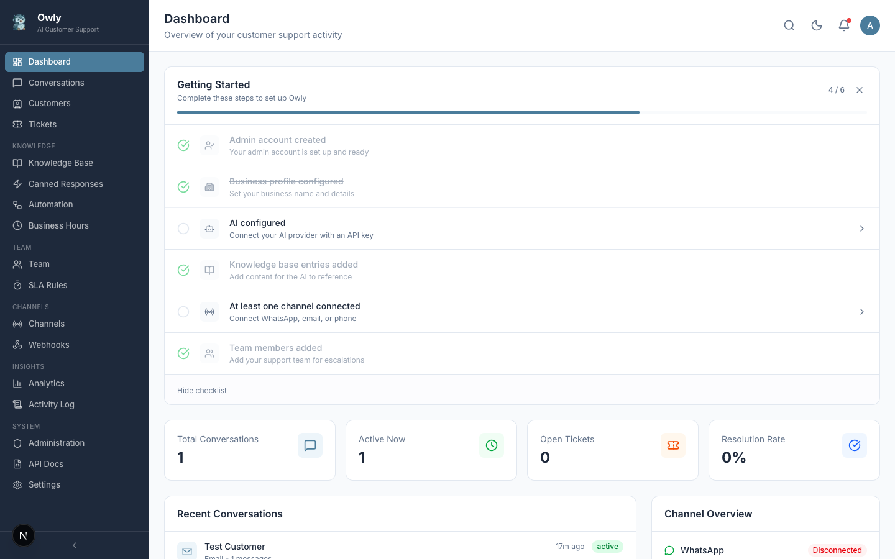

# Quick Start Tutorial

This tutorial walks you through getting Owly up and running with your first AI-powered customer conversation in approximately 5 minutes. By the end, you will have a working AI agent that answers questions based on your knowledge base.

---

## Prerequisites

- A machine with Node.js 20+ and PostgreSQL 16+ installed (or Docker).
- An OpenAI API key (or another supported provider key). You can get one at [platform.openai.com/api-keys](https://platform.openai.com/api-keys).

---

## Step 1: Install and Run Owly

Clone the repository, install dependencies, and start the development server:

```bash
git clone https://github.com/hsperus/owly.git
cd owly
cp .env.example .env
```

Edit `.env` and set your secret keys:

```bash
JWT_SECRET="your-random-secret-at-least-32-characters"
NEXTAUTH_SECRET="another-random-secret-string"
```

Then start the application:

**With Docker Compose:**

```bash
docker compose up -d
```

**Without Docker (requires local PostgreSQL running):**

```bash
npm install
npx prisma migrate dev
npm run dev
```

Open `http://localhost:3000` in your browser. You should be redirected to the setup wizard.

For a more detailed installation guide, see [Installation Guide](Installation-Guide).

---

## Step 2: Complete the Setup Wizard

The setup wizard walks you through three configuration steps. Fill them out as follows:

### Admin Account

- Enter your full name, a username, and a password (minimum 6 characters).
- Click **Next**.

### Business Profile

- Enter your business name and a short description.
- The description is important -- it tells the AI what your business does. For example: "Online electronics store specializing in smartphones, laptops, and accessories. We offer free shipping on orders over $50."
- Leave the welcome message as the default or customize it.
- Select a tone that matches your brand (Friendly is a good starting point).
- Click **Next**.

### AI Configuration

- Select **OpenAI** as the provider (or Claude/Ollama if you prefer).
- Choose a model. **gpt-4o-mini** is recommended for testing -- it is fast and inexpensive.
- Paste your OpenAI API key.
- Click **Finish Setup**.

You will see a summary screen. Click **Go to Dashboard** and then log in with the credentials you just created.

For detailed information about each wizard step, see [Setup Wizard](Setup-Wizard).

---

## Step 3: Add Knowledge Base Entries

The knowledge base is what makes your AI agent useful. Without it, the agent only has the business description from the setup wizard to work with. Adding knowledge base entries gives the AI specific information about your products, policies, and frequently asked questions.

### Navigate to Knowledge Base

From the sidebar, click **Knowledge Base**. You will see the knowledge base management page where you can create categories and entries.

### Create a Category

1. Click **New Category**.
2. Enter a name like "FAQ" or "Products".
3. Add a description for the category.
4. Click **Save**.

### Add an Entry

1. Select the category you just created.
2. Click **New Entry**.
3. Fill in:
   - **Title:** A descriptive name like "Return Policy" or "Shipping Information".
   - **Content:** The actual information the AI should know. Write it in plain language, as if you were explaining it to a support agent. For example:

     ```
     Our return policy allows customers to return any item within 30 days of
     purchase for a full refund. Items must be in original packaging and unused
     condition. Refunds are processed within 5-7 business days after we receive
     the returned item. Shipping costs for returns are covered by the customer
     unless the item was defective.
     ```

   - **Priority:** Set to "High" for essential information, "Medium" for general knowledge, or "Low" for supplementary details.
4. Make sure the **Active** toggle is on.
5. Click **Save**.

Add at least 3-5 entries to give the AI enough context to handle basic questions.


---

## Step 4: Configure the AI Provider

If you already entered your API key during the setup wizard, this step is done. Otherwise:

1. Navigate to **Settings** from the sidebar.
2. Scroll to the **AI Configuration** section.
3. Select your provider and model.
4. Enter your API key.
5. Click **Save**.

Verify the configuration by checking that no error banners appear after saving.

---

## Step 5: Test with Knowledge Base Test Mode

Before connecting a live channel, test that the AI is responding correctly using the built-in test functionality.

1. Go to **Knowledge Base** in the sidebar.
2. Select a category with entries.
3. Use the **Test** feature to ask a question that your knowledge base should be able to answer.
4. Verify that the AI response is accurate and uses information from your entries.


If the response is not accurate:

- Check that your knowledge base entries are **active** (toggle is on).
- Make sure the entry content is clear and specific.
- Try rephrasing the entry content to be more direct.
- Verify your AI API key is valid in Settings.

---

## Step 6: Connect a Channel

Now that your AI agent is working, connect a communication channel so customers can reach it.

### Fastest Option: Email

Email is the quickest channel to set up if you have IMAP/SMTP credentials:

1. Go to **Channels** from the sidebar.
2. Click **Configure** on the Email channel.
3. Enter your IMAP server details (host, port, username, password).
4. Enter your SMTP server details for outgoing responses.
5. Toggle the channel to **Active**.
6. Send a test email to the configured address and watch it appear in the Conversations inbox.

### WhatsApp (QR Code)

1. Go to **Channels** and click **Configure** on WhatsApp.
2. A QR code will appear on screen.
3. Open WhatsApp on your phone, go to Settings > Linked Devices > Link a Device, and scan the QR code.
4. The channel status will change to "Connected."
5. Send a WhatsApp message to the linked number and verify the AI responds.

### Phone (Twilio)

Phone requires Twilio and ElevenLabs API keys. See [Channel Setup](Channel-Setup) for the full guide.


---

## Verify Everything is Working

Go back to the **Dashboard**. You should see:

- The onboarding checklist showing progress on completed steps.
- Stat cards with initial values (likely all zeros until real conversations come in).
- The Channel Overview widget showing your connected channel(s).



Send a test message through your connected channel and confirm that:

1. The conversation appears in the **Conversations** inbox.
2. The AI responds using information from your knowledge base.
3. The response tone matches what you selected in the setup wizard.

---

## What to Do Next

Now that your basic setup is complete, consider these next steps to get the most out of Owly:

| Task | Guide |
|------|-------|
| Add more knowledge base entries for comprehensive coverage | [Knowledge Base Guide](Knowledge-Base-Guide) |
| Set up automation rules for routing and tagging | [Automation Rules](Automation-Rules) |
| Configure business hours and SLA targets | [Business Hours and SLA](Business-Hours-and-SLA) |
| Add team members for escalation handling | [Team and Departments](Team-and-Departments) |
| Create canned responses for common situations | [Canned Responses](Canned-Responses) |
| Connect additional channels | [Channel Setup](Channel-Setup) |
| Explore the analytics dashboard | [Dashboard](Dashboard) |

---

## Troubleshooting

| Problem | Solution |
|---------|----------|
| AI not responding | Check that your API key is valid in Settings. Verify the AI provider service is reachable. |
| Knowledge base entries not used | Ensure entries are toggled to Active. Check that the entry content is relevant to the test query. |
| Channel not connecting | See the [Channel Setup](Channel-Setup) guide for provider-specific troubleshooting. |
| Setup wizard reappears | This happens if the admin account creation failed silently. Check browser console for errors and try again. |
| Slow AI responses | Switch to a faster model like `gpt-4o-mini` or `gpt-3.5-turbo`. |

For more detailed troubleshooting, see the [Installation Guide](Installation-Guide#troubleshooting).
