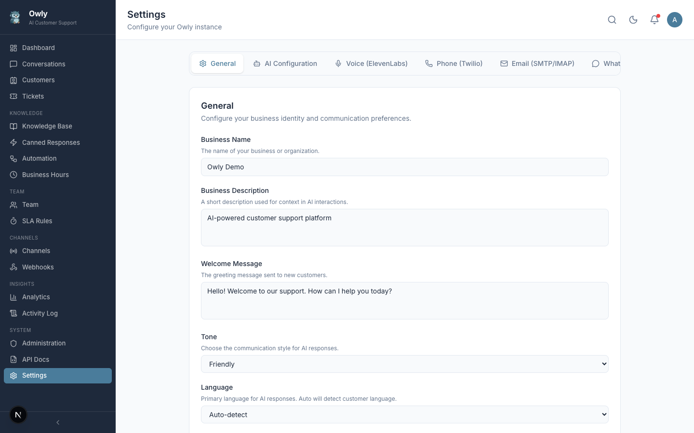

# Settings

The Settings page is the central configuration hub for your Owly instance. It controls how the AI behaves, which communication channels are active, and how your business is represented to customers.

---

## Navigation

The Settings page is organized into six tabs, each controlling a different aspect of your Owly deployment. Click any tab to switch between sections. Changes are saved per-section, so you can update one area without affecting others.

---

## General

The General tab defines your business identity and how the AI communicates with customers.

| Field | Description | Default |
|-------|-------------|---------|
| **Business Name** | Your company or brand name. Displayed in conversations and used by the AI to identify itself. | My Business |
| **Business Description** | A brief description of what your business does. The AI uses this as context when answering customer questions. | (empty) |
| **Welcome Message** | The greeting message sent when a new conversation begins. | Hello! How can I help you today? |
| **Tone** | Controls the AI's communication style. Options: `friendly` (warm and conversational), `formal` (professional and polished), `technical` (precise and detailed). | friendly |
| **Language** | The language the AI responds in. Set to `auto` to have the AI detect and match the customer's language, or select a specific language to enforce. | auto |

### Tone Examples

- **Friendly**: "Hey there! I'd be happy to help you with that. Let me check our records real quick."
- **Formal**: "Thank you for reaching out. I will look into this matter for you promptly."
- **Technical**: "Based on the error code you've described, this indicates a configuration mismatch. Here are the specific steps to resolve it."

---

## AI Configuration

The AI Configuration tab controls which language model powers Owly's conversational engine.

| Field | Description | Default |
|-------|-------------|---------|
| **AI Provider** | The AI service provider. Currently supports `openai`. Future versions may include Claude and Ollama. | openai |
| **Model** | The specific model to use. Examples: `gpt-4o-mini` (fast and affordable), `gpt-4o` (most capable). | gpt-4o-mini |
| **API Key** | Your provider's API key. This field is masked after saving for security. | (empty) |
| **Max Tokens** | Maximum number of tokens in the AI's response. Higher values allow longer responses but cost more. Range: 256 -- 4096. | 2048 |
| **Temperature** | Controls response randomness. Lower values (0.1 -- 0.3) produce more consistent responses. Higher values (0.7 -- 1.0) produce more creative ones. Range: 0 -- 2. | 0.7 |

### Choosing a Model

- **gpt-4o-mini**: Best for most use cases. Fast responses, low cost, good accuracy for customer support.
- **gpt-4o**: Use when you need the highest quality responses, such as complex technical support or nuanced conversations.

> **Important**: The API key is stored in your database. Owly never transmits it anywhere except to the configured AI provider. You can verify this in the source code at `src/lib/ai/engine.ts`.

---

## Voice (ElevenLabs)

The Voice tab configures text-to-speech capabilities for phone channel interactions.

| Field | Description | Default |
|-------|-------------|---------|
| **ElevenLabs API Key** | Your ElevenLabs API key for text-to-speech conversion. | (empty) |
| **Voice ID** | The ElevenLabs voice ID to use for generating speech. You can find available voices in your ElevenLabs dashboard. | (empty) |

Voice configuration is only required if you plan to use the phone channel with AI-generated voice responses. If you only use WhatsApp, email, or web chat, you can skip this section.

---

## Phone (Twilio)

The Phone tab configures Twilio integration for handling inbound and outbound phone calls.

| Field | Description | Default |
|-------|-------------|---------|
| **Twilio Account SID** | Your Twilio account identifier. Found on the Twilio Console dashboard. | (empty) |
| **Twilio Auth Token** | Your Twilio authentication token. Found on the Twilio Console dashboard. | (empty) |
| **Twilio Phone Number** | The Twilio phone number to use for calls, in E.164 format (e.g., `+15551234567`). | (empty) |

### Setting Up Twilio

1. Create a Twilio account at [twilio.com](https://www.twilio.com).
2. Purchase a phone number with voice capabilities.
3. Copy your Account SID and Auth Token from the Twilio Console.
4. Enter the credentials in Owly's Phone settings.
5. Configure your Twilio phone number's webhook URL to point to `https://your-owly-domain/api/channels/phone/incoming`.

---

## Email (SMTP/IMAP)

The Email tab configures both outbound (SMTP) and inbound (IMAP) email handling.

### SMTP (Outbound Email)

| Field | Description | Default |
|-------|-------------|---------|
| **SMTP Host** | The SMTP server hostname (e.g., `smtp.gmail.com`, `smtp.office365.com`). | (empty) |
| **SMTP Port** | The SMTP server port. Common values: `587` (TLS), `465` (SSL). | 587 |
| **SMTP User** | The username or email address for SMTP authentication. | (empty) |
| **SMTP Password** | The password or app-specific password for SMTP authentication. | (empty) |
| **From Address** | The email address that appears in the "From" field of outgoing emails. | (empty) |

### IMAP (Inbound Email)

| Field | Description | Default |
|-------|-------------|---------|
| **IMAP Host** | The IMAP server hostname (e.g., `imap.gmail.com`, `outlook.office365.com`). | (empty) |
| **IMAP Port** | The IMAP server port. Standard value: `993` (SSL). | 993 |
| **IMAP User** | The username or email address for IMAP authentication. | (empty) |
| **IMAP Password** | The password or app-specific password for IMAP authentication. | (empty) |

### Gmail-Specific Notes

If using Gmail, you must generate an App Password instead of using your regular password:

1. Enable 2-Factor Authentication on your Google account.
2. Go to Google Account > Security > App Passwords.
3. Generate a new app password for "Mail".
4. Use the generated 16-character password in both SMTP and IMAP password fields.

---

## WhatsApp

The WhatsApp tab configures how Owly connects to WhatsApp for messaging.

| Field | Description | Default |
|-------|-------------|---------|
| **Connection Mode** | How Owly connects to WhatsApp. Options: `web` (WhatsApp Web via QR code), `api` (WhatsApp Business API). | web |
| **API Key** | Required only for API mode. Your WhatsApp Business API key. | (empty) |
| **Phone Number** | Required only for API mode. The WhatsApp Business phone number. | (empty) |

### Connection Modes

- **Web Mode**: Uses `whatsapp-web.js` to connect through WhatsApp Web. Requires scanning a QR code from the Channels page. Suitable for small-scale deployments.
- **API Mode**: Uses the official WhatsApp Business API. Requires a WhatsApp Business account and approved API access. Suitable for production deployments with higher message volumes.

---

## Saving Changes

Each tab has its own "Save" button. When you save, only the fields in the current tab are updated. A success notification appears at the top of the page confirming the save. If any required fields are missing or invalid, an error notification is displayed instead.

Sensitive fields (API keys, passwords, tokens) are masked in the UI after saving. The full values are stored securely in the database but are never exposed in API responses to the frontend.
