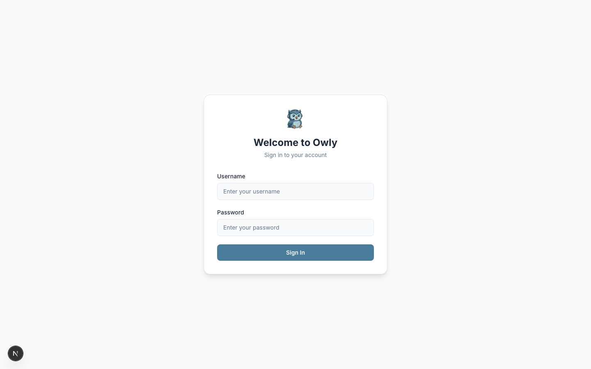

# Setup Wizard

When you launch Owly for the first time, you are automatically redirected to the Setup Wizard at `/setup`. This 4-step wizard walks you through creating your admin account, configuring your business profile, and connecting an AI provider. The wizard only appears once -- after completion, Owly redirects directly to the login page on subsequent visits.

---

## Overview

The wizard consists of four steps, displayed with a progress bar at the top of the page:

1. **Create Admin Account** -- Set up your primary administrator credentials
2. **Business Profile** -- Describe your business so the AI can represent you accurately
3. **AI Configuration** -- Choose your AI provider and model
4. **Completion** -- Review your setup and proceed to the dashboard

Each step is saved to the server as you progress, so if you close the browser partway through, your previous steps are preserved.

---

## Step 1: Create Admin Account

This step creates the first (and primary) administrator account for your Owly instance.

### Fields

| Field | Required | Description |
|-------|----------|-------------|
| **Full Name** | Yes | Your display name, shown in the admin panel and activity logs. |
| **Username** | Yes | Your login username. Choose something memorable. This is used for authentication. |
| **Password** | Yes | Must be at least 6 characters. Stored as a bcrypt hash -- never in plain text. |
| **Confirm Password** | Yes | Must match the password field exactly. |

### Tips

- Choose a strong password with a mix of letters, numbers, and symbols. While the minimum is 6 characters, longer passwords are more secure.
- The username cannot be changed after creation through the setup wizard, but it can be updated later from the Admin management page.
- This account has full administrator privileges. You can create additional admin accounts with different roles (admin, editor, viewer) later from the Team page.

### Validation

The wizard enforces these rules before allowing you to proceed:

- All four fields must be filled in.
- Password must be at least 6 characters.
- Password and Confirm Password must match exactly.

If validation fails, an error message appears below the form fields in a red banner.

---

## Step 2: Business Profile

This step tells Owly about your business so the AI agent can respond to customers with accurate context and appropriate tone.

### Fields

| Field | Required | Default | Description |
|-------|----------|---------|-------------|
| **Business Name** | No | "My Business" | Your company or brand name. Used in AI responses and displayed in the admin panel header. |
| **Description** | No | (empty) | A brief description of what your business does. This is included in the AI system prompt so the agent understands your industry and services. |
| **Welcome Message** | No | "Hello! How can I help you today?" | The first message customers see when they start a conversation. |
| **Response Tone** | No | Friendly | Controls the communication style of AI responses. |

### Tone Options

The tone selector presents four options in a 2x2 grid:

| Tone | Description |
|------|-------------|
| **Friendly** | Warm and approachable. Good default for most businesses. |
| **Professional** | Formal and business-like. Suitable for B2B, legal, and financial services. |
| **Casual** | Relaxed and conversational. Works well for consumer brands and social-first businesses. |
| **Concise** | Short and to the point. Ideal for technical support and developer-facing products. |

### Tips

- The business description is one of the most important fields for AI accuracy. Be specific about your products, services, and target audience. For example, instead of "We sell things online," write "We sell handmade ceramics and pottery supplies to hobbyists and professional potters across North America."
- The welcome message appears at the start of every new conversation. Keep it short and action-oriented.
- You can change all of these settings later from the Settings page (`/settings`) at any time.
- Tone affects every AI response. If you are unsure, start with "Friendly" and adjust after reviewing a few test conversations.

---

## Step 3: AI Configuration

This step configures the AI model that powers your support agent. Owly supports multiple AI providers.

### Fields

| Field | Required | Description |
|-------|----------|-------------|
| **AI Provider** | Yes | The AI service to use. Defaults to OpenAI. |
| **Model** | Yes | The specific model from the selected provider. The model list updates when you change the provider. |
| **API Key** | Conditional | Required for OpenAI and Claude. Not required for Ollama (local models). |

### Supported Providers and Models

**OpenAI:**

| Model | Notes |
|-------|-------|
| `gpt-4o` | Best overall quality. Recommended for production. |
| `gpt-4o-mini` | Default selection. Good balance of quality and cost. |
| `gpt-4-turbo` | Previous generation. High quality, higher cost. |
| `gpt-3.5-turbo` | Fastest and cheapest. Lower quality for complex queries. |

**Claude (Anthropic):**

| Model | Notes |
|-------|-------|
| `claude-sonnet-4-20250514` | High quality, good speed. Recommended for Claude users. |
| `claude-3-5-haiku-20241022` | Fast and cost-effective. |
| `claude-3-opus-20240229` | Highest quality Claude model. |

**Ollama (Local):**

| Model | Notes |
|-------|-------|
| `llama3` | Meta's open model. Good general-purpose choice. |
| `mistral` | Mistral AI. Strong reasoning capabilities. |
| `codellama` | Optimized for technical/code-related support. |
| `phi3` | Microsoft's compact model. Lower resource requirements. |

### Tips

- If you choose Ollama, Owly expects an Ollama server running locally on the default port (11434). No API key is needed.
- You can get an OpenAI API key at [platform.openai.com/api-keys](https://platform.openai.com/api-keys).
- You can get a Claude API key at [console.anthropic.com](https://console.anthropic.com).
- Start with `gpt-4o-mini` if you want low cost while testing. Switch to `gpt-4o` or a Claude model for production use where response quality matters more.
- The API key is stored encrypted in the database. You can update it later from Settings.
- Use the Show/Hide toggle next to the API key field to verify what you entered.

---

## Step 4: Completion

The final step shows a summary of everything you configured:

- **Admin account created** -- Displays your chosen username with a green checkmark.
- **Business profile configured** -- Shows your business name (or "Default settings" if you skipped customization).
- **AI provider configured** -- Shows the selected provider and model (e.g., "OpenAI / gpt-4o-mini").

Each item shows a green checkmark if the step was saved successfully, or a grey dash if it was skipped or encountered an error.

Click **Go to Dashboard** to leave the wizard and enter the main application. You will be redirected to the login page where you can sign in with the admin credentials you just created.

---

## After the Wizard

Once you complete the setup wizard and log in, Owly redirects you to the Dashboard. You will see the **Onboarding Checklist** widget with your progress:

The onboarding checklist tracks six milestones:

1. Admin account created (completed by the wizard)
2. Business profile configured (completed by the wizard)
3. AI configured (completed by the wizard)
4. Knowledge base entries added
5. At least one channel connected
6. Team members added

The remaining three items guide you through the next configuration steps. See the [Quick Start Tutorial](Quick-Start-Tutorial) for a walkthrough of completing them.

---

## Returning to Setup

The setup wizard only appears when no admin account exists in the database. Once the first admin account is created, the `/setup` route automatically redirects to `/login`. All settings configured during the wizard can be modified later from the Settings page and Admin page.

---

## Next Steps

- [Quick Start Tutorial](Quick-Start-Tutorial) -- Complete your first AI conversation in 5 minutes
- [Dashboard](Dashboard) -- Learn about the dashboard widgets and navigation
- [Knowledge Base Guide](Knowledge-Base-Guide) -- Add knowledge entries so the AI can answer customer questions accurately
