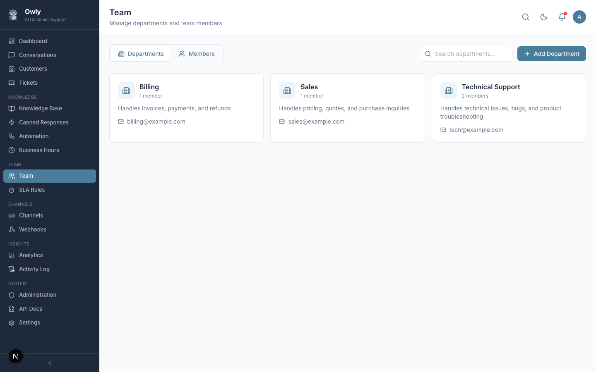

# Team and Departments

The Team page lets you organize your support staff into departments and manage individual team members. This structure is essential for ticket routing, AI-powered issue assignment, and workload distribution.


*The Team page showing departments with their members, expertise areas, roles, and availability toggles.*

---

## Departments

Departments represent functional groups within your organization. They help the AI route issues to the right group of people.

### Creating a Department

1. Navigate to **Team** in the sidebar
2. Click **Add Department**
3. Fill in the department details:

| Field | Description | Example |
|-------|-------------|---------|
| Name | The department name | "Technical Support" |
| Description | What this department handles | "Handles all technical issues, bug reports, and product questions" |
| Email | Contact email for the department | "tech@yourcompany.com" |

4. Click **Save**

### Department Examples

| Department | Description | Typical Issues |
|------------|-------------|----------------|
| Technical Support | Product and technical issues | Bugs, errors, how-to questions |
| Billing | Payment and account questions | Invoices, refunds, subscriptions |
| Sales | Pre-purchase inquiries | Pricing, demos, custom plans |
| General Support | Catch-all for other inquiries | General questions, feedback |

---

## Team Members

Team members are the individuals within each department who handle customer issues.

### Adding a Team Member

1. Open the department where the member belongs
2. Click **Add Member**
3. Fill in the member details:

| Field | Description | Example |
|-------|-------------|---------|
| Name | The team member's full name | "Jane Smith" |
| Email | Their email address | "jane@yourcompany.com" |
| Phone | Their phone number (optional) | "+1-555-0123" |
| Role | Their role within the team | "member" or "lead" |
| Expertise | Areas of expertise (comma-separated) | "billing, refunds, payment processing" |
| Department | The department they belong to | "Billing" |

4. Click **Save**

---

## Understanding Expertise Fields

The **expertise** field is one of the most important fields for AI-powered routing. When the AI creates a ticket and needs to assign it to someone, it searches for team members whose expertise matches the issue.

### How Expertise Matching Works

1. A customer reports an issue: "I was charged twice for my subscription"
2. The AI creates a ticket with expertise area: "billing"
3. Owly searches for available team members whose expertise field contains "billing"
4. The ticket is assigned to the best matching available team member

### Best Practices for Expertise Fields

- Use specific, descriptive keywords: `refunds, billing disputes, payment processing` rather than just `billing`
- Include variations of terms customers might use: `shipping, delivery, tracking, logistics`
- Keep expertise focused per team member. It is better for each person to have well-defined specialties than for everyone to list everything
- Review and update expertise fields as team responsibilities change

---

## Availability Toggle

Each team member has an availability toggle that indicates whether they are currently available to receive ticket assignments.

| Status | Meaning |
|--------|---------|
| Available (on) | The team member can receive new ticket assignments from the AI |
| Unavailable (off) | The team member will not be assigned new tickets |

### When to Toggle Availability Off

- The team member is on vacation or leave
- They are handling a high volume of existing tickets
- They are in a meeting or otherwise occupied
- Outside of their working hours

> **Important:** The AI only assigns tickets to team members who are marked as available. If no available member matches the required expertise, the AI will inform the customer that no specialist is currently available and the ticket will remain unassigned.

---

## How AI Routes Issues to Team Members

The AI uses the following logic when deciding who should handle an issue:

1. **Expertise matching** -- The AI identifies the topic of the customer's issue and looks for team members with matching expertise keywords
2. **Availability check** -- Only team members marked as available are considered
3. **Department context** -- If a department is specified on the ticket, members of that department are prioritized
4. **Tool execution** -- The AI uses the `assign_to_person` tool to find the best match and assign the ticket

### Example Routing Flow

```
Customer: "I need help with my invoice from last month."
    |
    v
AI recognizes: billing/invoice topic
    |
    v
AI calls create_ticket tool:
  - Title: "Invoice inquiry"
  - Priority: medium
  - Department: Billing
    |
    v
AI calls assign_to_person tool:
  - Expertise: "billing, invoices"
    |
    v
System finds: Jane Smith (Billing dept, expertise: "billing, refunds, invoices")
  - isAvailable: true
    |
    v
Ticket assigned to Jane Smith
```

---

## Next Steps

- [Ticket System](Ticket-System) -- See how tickets are assigned and tracked
- [Automation Rules](Automation-Rules) -- Set up automatic routing rules
- [Business Hours and SLA](Business-Hours-and-SLA) -- Define availability schedules and response targets
