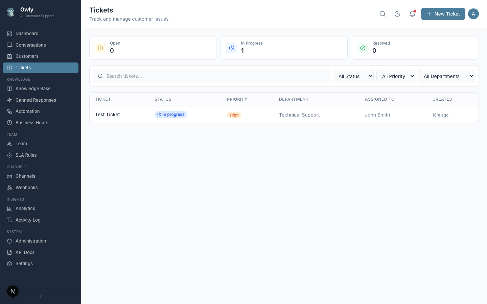

# Tickets

The Ticket System tracks customer issues that require structured follow-up beyond a single conversation reply. Tickets provide a formal record of problems, their priority, who is responsible for resolving them, and how they were ultimately addressed. They can be created manually by administrators or automatically by the AI during conversations.


*The Tickets page showing a list of tickets with priority levels, status counters, department assignments, and team member assignments.*

---

## Table of Contents

- [Overview](#overview)
- [Creating Tickets](#creating-tickets)
- [Ticket Fields](#ticket-fields)
- [Priority Levels](#priority-levels)
- [Status Flow](#status-flow)
- [Department Assignment](#department-assignment)
- [Team Member Assignment](#team-member-assignment)
- [Resolution Tracking](#resolution-tracking)
- [Filtering and Search](#filtering-and-search)
- [How the AI Creates Tickets Automatically](#how-the-ai-creates-tickets-automatically)
- [Practical Tips](#practical-tips)

---

## Overview

Not every customer interaction can be resolved in a single conversation. Some issues require investigation, coordination between departments, or follow-up over days or weeks. The ticket system provides the structure to track these issues from identification to resolution.

Tickets in Owly are tightly integrated with the rest of the platform:

- **Conversations.** Tickets are linked to the conversation where the issue was first reported, preserving the full context.
- **Departments.** Tickets are assigned to the department best equipped to handle the issue.
- **Team members.** Individual team members are assigned responsibility for resolving specific tickets.
- **AI agent.** The AI can create tickets automatically during conversations when it detects issues that need human attention.

---

## Creating Tickets

### Manual Creation

Administrators can create tickets directly from the Tickets page:

1. Navigate to **Tickets** in the sidebar.
2. Click **Create Ticket**.
3. Fill in the ticket details:
   - **Title** -- A brief summary of the issue.
   - **Description** -- A detailed explanation of the problem, including any relevant context.
   - **Priority** -- Select the appropriate urgency level (low, medium, high, or urgent).
   - **Department** -- Optionally assign the ticket to a department.
   - **Assigned To** -- Optionally assign the ticket to a specific team member.
4. Click **Save**.

### When to Create Tickets Manually

| Scenario | Example |
|----------|---------|
| Issue discovered during conversation review | You notice an unresolved complaint while reviewing conversations and create a ticket to track it. |
| Proactive issue tracking | A known system issue is affecting multiple customers. Create a ticket to track the resolution. |
| Internal task | A team member needs to update documentation or investigate a recurring problem. |
| Customer request via offline channel | A customer calls and requests something that cannot be handled immediately. |

### Automatic Creation by the AI

The AI creates tickets during conversations using the `create_ticket` tool. See [How the AI Creates Tickets Automatically](#how-the-ai-creates-tickets-automatically) for details.

---

## Ticket Fields

Each ticket contains the following information:

| Field | Description | Values |
|-------|-------------|--------|
| **Title** | A brief summary of the issue | Free text |
| **Description** | Detailed explanation of the problem, including customer context | Free text |
| **Priority** | The urgency level | `low`, `medium`, `high`, `urgent` |
| **Status** | The current lifecycle stage | `open`, `in_progress`, `resolved`, `closed` |
| **Department** | The department responsible for the ticket | Any configured department (optional) |
| **Assigned To** | The team member handling the ticket | Any team member (optional) |
| **Conversation** | The linked conversation where the issue originated | Auto-linked when created by the AI; can be linked manually |
| **Resolution** | Notes documenting how the issue was resolved | Free text (typically filled when resolving) |
| **Created At** | Timestamp of ticket creation | Auto-set |
| **Updated At** | Timestamp of the last modification | Auto-set |

---

## Priority Levels

Priority indicates how urgently a ticket needs attention. Owly supports four priority levels:

| Priority | Description | Typical Response Expectation | Example Scenarios |
|----------|-------------|------------------------------|-------------------|
| **Low** | Non-urgent requests that can be addressed when time permits | Within a few days | Feature suggestions, minor cosmetic issues, general inquiries about future plans |
| **Medium** | Standard issues that affect the customer but are not blocking | Within 24 hours | Order status inquiries, account update requests, product questions requiring research |
| **High** | Significant problems that impact the customer's ability to use your product or service | Within a few hours | Service disruptions for individual customers, billing errors, failed deliveries |
| **Urgent** | Critical issues requiring immediate attention | As soon as possible | System-wide outages, security incidents, safety concerns, legal compliance issues |

### Setting Priority Correctly

Priority should reflect the impact on the customer and the urgency of resolution, not the complexity of the fix. A simple problem that blocks a customer from using your service is "high" or "urgent", while a complex enhancement request that no one is waiting on is "low".

Consider these factors when assigning priority:

- **Number of affected customers.** An issue affecting many customers warrants higher priority.
- **Business impact.** Issues that prevent revenue generation or damage reputation are inherently urgent.
- **Time sensitivity.** Issues with deadlines (e.g., event-related, legal compliance) need appropriate priority.
- **Customer tier.** If you have VIP or enterprise customers, their issues may warrant higher default priority.

---

## Status Flow

Tickets follow a linear lifecycle from creation to closure:

```
open --> in_progress --> resolved --> closed
```

| Status | Description | Who Typically Sets It |
|--------|-------------|----------------------|
| **Open** | The ticket has been created but no one has started working on it. It is waiting in the queue. | Set automatically when the ticket is created. |
| **In Progress** | A team member has been assigned and is actively working on the issue. | Set automatically when a team member is assigned, or manually by an administrator. |
| **Resolved** | The issue has been addressed. Resolution notes should explain what was done. | Set manually by the assigned team member or an administrator after fixing the issue. |
| **Closed** | The ticket is finalized. The resolution has been confirmed and no further action is needed. | Set manually after verifying the customer is satisfied with the resolution. |

### Status Transitions

| Transition | When It Happens |
|------------|-----------------|
| Open to In Progress | A team member is assigned to the ticket (automatically or manually). |
| In Progress to Resolved | The assigned person completes the work and documents the resolution. |
| Resolved to Closed | An administrator confirms the resolution is satisfactory and finalizes the ticket. |
| Any status to Open | A ticket can be reopened if the issue resurfaces or the resolution was insufficient. |

### Why Separate "Resolved" and "Closed"?

The distinction between resolved and closed provides a verification step. When a team member marks a ticket as resolved, it signals that they believe the work is done. An administrator (or the assigned person, after confirming with the customer) then closes the ticket to confirm the resolution was satisfactory. This two-step process prevents tickets from being prematurely finalized.

---

## Department Assignment

Tickets can be assigned to a department to route them to the appropriate team.

### How Department Assignment Works

1. When creating or editing a ticket, select a department from the dropdown.
2. The ticket appears in that department's queue.
3. Team members within the department can see the ticket and take ownership.

### When to Assign Departments

| Department | Ticket Examples |
|------------|----------------|
| Technical Support | Software bugs, integration issues, API errors |
| Billing | Payment failures, invoice disputes, refund requests |
| Sales | Upgrade requests, pricing questions, custom plan inquiries |
| Shipping | Delivery delays, lost packages, address changes |
| Product | Feature requests, product feedback, usability issues |

> **Tip:** If you are unsure which department should handle a ticket, assign it to the most relevant one. It can always be reassigned later. What matters is that the ticket is not left unassigned.

---

## Team Member Assignment

Within a department, tickets are assigned to individual team members who take responsibility for resolving them.

### Manual Assignment

1. Open the ticket.
2. Select a department from the dropdown (if not already set).
3. Select a team member from the available members in that department.
4. Save the changes.

When a team member is assigned, the ticket status automatically transitions to "In Progress" if it was previously "Open".

### Automatic Assignment by the AI

When the AI creates a ticket during a conversation, it can also use the `assign_to_person` tool to assign the ticket to a team member. The process works as follows:

1. The AI creates a ticket using `create_ticket`, specifying a title, description, priority, and optionally a department.
2. The AI then calls `assign_to_person` with the ticket ID and the expertise area needed.
3. The system searches for available team members whose expertise matches the requested area.
4. The best-matching available team member is assigned to the ticket.
5. The ticket status is updated to "In Progress".

### Considerations for Assignment

- **Availability.** Each team member has an `isAvailable` flag. Only available members should be assigned new tickets.
- **Expertise match.** When the AI assigns tickets, it matches the required expertise against team member expertise profiles. Keep these profiles up to date for best results.
- **Workload balance.** Check the number of open tickets each team member currently has before assigning new ones. The [Analytics](Analytics-and-Reports) page provides workload metrics.

---

## Resolution Tracking

When resolving a ticket, documenting the resolution is critical for accountability, knowledge sharing, and continuous improvement.

### How to Resolve a Ticket

1. Open the ticket.
2. Add resolution notes in the resolution field, explaining what was done to address the issue.
3. Change the status to **Resolved**.
4. Save the changes.

### What to Include in Resolution Notes

| Element | Example |
|---------|---------|
| What the problem was | "Customer received the wrong product variant (blue instead of red)." |
| What action was taken | "Shipped the correct variant via express delivery. Provided return label for the incorrect item." |
| Any compensation provided | "Applied a 15% discount code for the inconvenience." |
| Follow-up required | "Customer will confirm receipt of replacement by Friday. If not received, escalate to logistics." |
| Root cause (if identified) | "Warehouse picked from wrong bin. Inventory team notified to re-label." |

### Benefits of Thorough Resolution Notes

- **Training resource.** New team members can learn how common issues are handled by reviewing resolved tickets.
- **Pattern identification.** If the same root cause appears across multiple tickets, it signals a systemic issue that needs a broader fix.
- **Knowledge base improvement.** A frequently resolved issue type is a candidate for a new knowledge base entry, which allows the AI to handle it without creating a ticket next time.
- **Audit trail.** Resolution notes provide a record of what was done and why, which is valuable for compliance and customer follow-up.

---

## Filtering and Search

The Tickets page provides multiple ways to locate specific tickets.

### Status Counters

At the top of the Tickets page, counters display the number of tickets in each status:

| Counter | Action |
|---------|--------|
| **Open** | Click to show only open tickets |
| **In Progress** | Click to show only tickets currently being worked on |
| **Resolved** | Click to show only resolved tickets |
| **Closed** | Click to show only closed tickets |

These counters also serve as a quick health check for your support operation. A growing number of open tickets signals a capacity issue; a high number of resolved-but-not-closed tickets suggests the verification step is being skipped.

### Search

Use the search bar to find tickets by:
- Ticket title
- Ticket description
- Customer name (from the linked conversation)

### Filter Options

You can combine multiple filters to narrow the ticket list:

| Filter | Options |
|--------|---------|
| **Status** | Open, In Progress, Resolved, Closed |
| **Priority** | Low, Medium, High, Urgent |
| **Department** | Any configured department |
| **Assigned To** | Any team member |

Filters can be combined. For example, you can view all "High" priority tickets that are "Open" in the "Technical Support" department.

---

## How the AI Creates Tickets Automatically

One of Owly's most powerful features is the AI's ability to create tickets during conversations without human intervention.

### When the AI Creates a Ticket

The AI uses the `create_ticket` tool when:

- **The customer reports a problem the AI cannot resolve.** If the knowledge base does not contain sufficient information to address the issue, the AI creates a ticket rather than guessing.
- **The issue requires a physical or procedural action.** Replacing a defective product, processing a refund, or scheduling a technician visit cannot be done by the AI alone.
- **The customer explicitly requests escalation.** If the customer asks to speak with a human or requests their issue be formally tracked, the AI creates a ticket.
- **The conversation involves a safety or legal concern.** The AI is configured to escalate these issues rather than attempt to handle them.

### What the AI Includes in the Ticket

When the AI creates a ticket, it provides:

| Field | How the AI Fills It |
|-------|---------------------|
| **Title** | A concise summary of the issue derived from the conversation |
| **Description** | A detailed explanation including relevant conversation context |
| **Priority** | Selected based on the urgency signals in the customer's messages |
| **Department** | Specified if the AI can identify the appropriate department from the issue type |

The ticket is automatically linked to the originating conversation, so any team member who picks up the ticket can read the full conversation thread for context.

### What Happens After Automatic Creation

1. The ticket appears in the Tickets page with "Open" status.
2. If the AI also calls `assign_to_person`, the ticket is assigned to a matching team member and its status changes to "In Progress".
3. The AI informs the customer that their issue has been logged and will be handled by the team.
4. The assigned team member can open the ticket, review the linked conversation, and take action.

### Example Flow

1. A customer messages via WhatsApp: "I received a broken laptop screen in my order."
2. The AI checks the knowledge base but finds no resolution procedure for damaged deliveries.
3. The AI calls `create_ticket` with:
   - Title: "Damaged product received - broken laptop screen"
   - Description: "Customer reports receiving a laptop with a broken screen. Order details discussed in conversation. Customer is requesting a replacement."
   - Priority: "high"
   - Department: "Shipping"
4. The AI calls `assign_to_person` with the expertise area "shipping and returns".
5. The system finds an available team member in the Shipping department with matching expertise and assigns the ticket.
6. The AI replies to the customer: "I have created a support ticket for your damaged product and assigned it to our shipping team. A team member will follow up with you shortly regarding a replacement."

---

## Practical Tips

1. **Do not let tickets sit in "Open" status.** An open ticket with no assignee is a ticket no one is working on. Assign tickets to a department and team member as quickly as possible.

2. **Write resolution notes even for simple fixes.** It takes 30 seconds and saves significant time when a similar issue arises later or when a customer follows up weeks later.

3. **Use priority consistently.** If everything is marked "urgent", nothing is truly urgent. Reserve the urgent priority for genuine emergencies and use medium/high for standard and significant issues.

4. **Close resolved tickets promptly.** A large backlog of resolved-but-not-closed tickets obscures the true state of your support operation. Review resolved tickets weekly and close those that have been confirmed.

5. **Link tickets to conversations.** When creating tickets manually, link them to the relevant conversation whenever possible. This preserves context and prevents information from being lost.

6. **Review AI-created tickets for quality.** Periodically check the tickets the AI creates to ensure the titles, descriptions, and priorities are accurate. If the AI consistently misprioritizes certain issue types, consider adjusting your knowledge base or AI configuration.

7. **Use ticket data to improve the knowledge base.** If the AI creates tickets for the same type of issue repeatedly, that issue is a candidate for a knowledge base entry. Adding the resolution as a KB entry allows the AI to handle it directly in future conversations, reducing ticket volume.

8. **Monitor status counters daily.** The counters at the top of the Tickets page are a quick health indicator. A sudden spike in open tickets deserves immediate investigation.

---

## Related Pages

- [Conversations](Conversations) -- View the conversations linked to tickets
- [Customers](Customers) -- View customer profiles associated with tickets
- [Team and Departments](Team-and-Departments) -- Configure departments and team members for ticket assignment
- [Automation Rules](Automation-Rules) -- Set up rules to auto-route tickets based on conditions
- [Business Hours and SLA](Business-Hours-and-SLA) -- Define response time targets for ticket priorities
