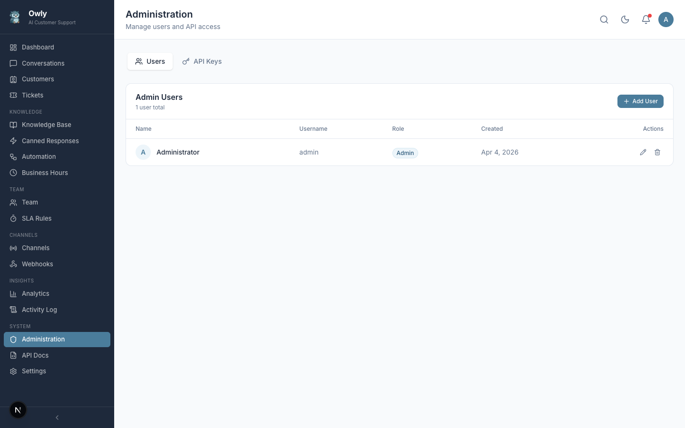

# User Management

The Admin page provides user account management and API key administration for your Owly instance. This page is accessible from the sidebar under the "Admin" section.

---

## Overview

The Admin page has two tabs:

1. **Users** -- Manage admin accounts that can access the Owly dashboard.
2. **API Keys** -- Manage API keys for programmatic access (covered in the [API Keys](API-Keys) page).

Only authenticated users can access this page. The user management features described here are available under the "Users" tab.

---

## Roles

Owly supports three roles with different access levels:

| Role | Dashboard Access | Manage Content | System Settings | User Management |
|------|-----------------|----------------|-----------------|-----------------|
| **Admin** | Full access | Yes | Yes | Yes |
| **Editor** | Full access | Yes | No | No |
| **Viewer** | Read-only | No | No | No |

### Role Descriptions

- **Admin**: Complete control over the Owly instance. Can manage all settings, users, knowledge base, conversations, tickets, channels, and integrations. At least one admin account must exist at all times.
- **Editor**: Can manage content-related features such as knowledge base entries, canned responses, and conversation handling. Cannot modify system settings, user accounts, or API keys.
- **Viewer**: Read-only access to the dashboard. Can view conversations, tickets, analytics, and other data but cannot create, modify, or delete anything.

---

## Creating a New User

1. Navigate to the Admin page from the sidebar.
2. Ensure the "Users" tab is selected.
3. Click the "Add User" button in the top-right corner.
4. Fill in the required fields in the modal dialog:

| Field | Required | Description |
|-------|----------|-------------|
| **Name** | Yes | The display name for the user. Shown in the dashboard and activity logs. |
| **Username** | Yes | The unique login identifier. Must be unique across all users. |
| **Password** | Yes | The account password. Stored as a bcrypt hash in the database. |
| **Role** | Yes | Select one of: `admin`, `editor`, or `viewer`. Defaults to `viewer`. |

5. Click "Save" to create the account.

The new user can immediately log in with their username and password at the `/login` page.

---

## Editing a User

1. Locate the user in the users list.
2. Click the pencil (edit) icon on the user's row.
3. Modify the desired fields in the modal dialog:
   - **Name**: Update the display name.
   - **Username**: Change the login identifier (must remain unique).
   - **Role**: Change the user's access level.
4. Click "Save" to apply changes.

> **Note**: Changes to a user's role take effect on their next page load or API request. Active sessions are not immediately invalidated.

---

## Changing a Password

When editing a user, leave the password field empty to keep the current password unchanged. To set a new password, enter the new password in the password field. The new password will be hashed with bcrypt before storage.

There is no "current password" verification when an admin changes another user's password. This is by design, as only admin-role users can access user management.

---

## Deleting a User

1. Locate the user in the users list.
2. Click the trash (delete) icon on the user's row.
3. Confirm the deletion in the confirmation dialog.

### Last Admin Protection

Owly prevents deleting the last remaining admin account. If you attempt to delete a user and they are the only account with the `admin` role, the operation will be rejected with an error message. This safeguard ensures you cannot lock yourself out of the system.

To delete an admin account when it is the last one:

1. First create a new admin account.
2. Then delete the original account.

---

## User List Display

The users table displays the following information for each account:

| Column | Description |
|--------|-------------|
| **Name** | The user's display name. |
| **Username** | The login identifier. |
| **Role** | A color-coded badge showing the user's role (blue for admin, amber for editor, gray for viewer). |
| **Created** | The date the account was created. |
| **Actions** | Edit and delete buttons. |

---

## Security Considerations

- Passwords are hashed with bcrypt before storage. Plain-text passwords are never stored or logged.
- Authentication uses JWT tokens stored in HTTP-only cookies (`owly-token`).
- There is no built-in password complexity requirement. It is recommended to use strong passwords for all accounts.
- Session tokens do not currently expire automatically. Users should log out when they are done.
- All user management actions are recorded in the Activity Log for audit purposes.
