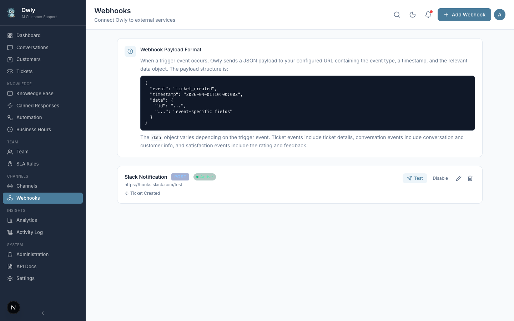

# Webhooks

Webhooks allow Owly to notify external systems in real time when specific events occur. Instead of polling the API for changes, your applications receive HTTP requests automatically when events like ticket creation, conversation start, or escalation happen.



---

## What Are Webhooks

A webhook is an HTTP callback: when a configured event occurs in Owly, it sends an HTTP request to a URL you specify. This enables real-time integrations without writing polling logic. For example, you can:

- Post a notification to a Slack channel when a new ticket is created.
- Send a Discord message when a conversation is escalated to a human agent.
- Trigger a Zapier workflow when a customer submits a satisfaction rating.
- Update an external CRM when a conversation closes.
- Alert on-call staff when an urgent escalation occurs.

---

## Creating a Webhook

1. Navigate to the Webhooks page from the sidebar.
2. Click the "Add Webhook" button.
3. Fill in the webhook configuration in the modal dialog:

| Field | Required | Description |
|-------|----------|-------------|
| **Name** | Yes | A descriptive name for the webhook (e.g., "Slack Ticket Alert", "CRM Sync"). |
| **Description** | No | Optional notes about what this webhook does. |
| **URL** | Yes | The endpoint URL that will receive the HTTP request. Must be a valid, publicly accessible URL. |
| **Method** | Yes | The HTTP method to use. Options: `GET`, `POST`, `PUT`. Defaults to `POST`. |
| **Headers** | No | Custom HTTP headers to include with the request. Add key-value pairs for authentication tokens, content types, or other headers your endpoint requires. |
| **Trigger Event** | Yes | The event that triggers this webhook. See the list of available events below. |

4. Click "Save" to create the webhook.

The webhook is created in an active state by default and will begin firing immediately when its trigger event occurs.

---

## Available Trigger Events

| Event | Value | Description |
|-------|-------|-------------|
| **Ticket Created** | `ticket_created` | Fires when a new support ticket is created, either manually or by the AI during a conversation. |
| **Conversation Started** | `conversation_started` | Fires when a new conversation is initiated on any channel (WhatsApp, email, phone, web chat, or API). |
| **Escalation** | `escalation` | Fires when a conversation or ticket is escalated to a human team member. |
| **Conversation Closed** | `conversation_closed` | Fires when a conversation's status changes to closed or resolved. |
| **Satisfaction Received** | `satisfaction_received` | Fires when a customer submits a satisfaction rating for a conversation. |

Each webhook is configured with exactly one trigger event. To listen for multiple events, create multiple webhooks pointing to the same URL (or different URLs as needed).

---

## Payload Format

When a webhook fires, Owly sends a JSON payload to the configured URL. The payload structure includes metadata about the event and the relevant entity.

### Example Payload (ticket_created)

```json
{
  "event": "ticket_created",
  "timestamp": "2026-04-05T14:30:00.000Z",
  "data": {
    "id": "a1b2c3d4-e5f6-7890-abcd-ef1234567890",
    "title": "Cannot access my account",
    "description": "Customer reports being locked out after password reset",
    "status": "open",
    "priority": "high",
    "conversationId": "f0e1d2c3-b4a5-6789-0123-456789abcdef",
    "departmentId": null,
    "assignedToId": null,
    "createdAt": "2026-04-05T14:30:00.000Z"
  }
}
```

### Example Payload (conversation_started)

```json
{
  "event": "conversation_started",
  "timestamp": "2026-04-05T14:30:00.000Z",
  "data": {
    "id": "f0e1d2c3-b4a5-6789-0123-456789abcdef",
    "channel": "whatsapp",
    "customerName": "Jane Doe",
    "customerContact": "+15551234567",
    "status": "active",
    "createdAt": "2026-04-05T14:30:00.000Z"
  }
}
```

### Example Payload (satisfaction_received)

```json
{
  "event": "satisfaction_received",
  "timestamp": "2026-04-05T15:00:00.000Z",
  "data": {
    "conversationId": "f0e1d2c3-b4a5-6789-0123-456789abcdef",
    "satisfaction": 5,
    "customerName": "Jane Doe",
    "channel": "whatsapp"
  }
}
```

---

## Testing Webhooks

Owly provides a built-in test feature for each webhook:

1. Locate the webhook in the list.
2. Click the "Test" button (send icon) on the webhook's row.
3. Owly sends a test request to the configured URL with a sample payload.
4. The result is displayed inline, showing:
   - **Success**: HTTP status code and a preview of the response body.
   - **Failure**: The error message or HTTP error status.

Use testing to verify that your endpoint is reachable and properly configured before relying on the webhook in production.

> **Tip**: For development and debugging, use a service like [webhook.site](https://webhook.site) or [requestbin.com](https://requestbin.com) as a temporary URL to inspect the payloads Owly sends.

---

## Retry Behavior

Owly sends webhook requests synchronously when the triggering event occurs. If the request fails (network error, timeout, or non-2xx response), the current implementation does not automatically retry. The webhook fires once per event.

For critical integrations where delivery guarantees are important, consider:

- Using a middleware service (like Zapier or n8n) that provides its own retry logic.
- Implementing an acknowledgment pattern where your endpoint confirms receipt and Owly logs the delivery status.
- Monitoring the Activity Log for webhook-related events.

---

## Managing Webhooks

### Activating and Deactivating

Each webhook has an active/inactive toggle. Inactive webhooks are not fired when their trigger event occurs. Use this to temporarily pause a webhook without deleting its configuration.

### Editing

Click the pencil icon on a webhook's row to open the edit modal. You can modify any field: name, URL, method, headers, or trigger event.

### Deleting

Click the trash icon on a webhook's row and confirm the deletion. Deleted webhooks are permanently removed.

---

## Common Integrations

### Slack

To send notifications to a Slack channel:

1. Create a Slack Incoming Webhook at [api.slack.com/messaging/webhooks](https://api.slack.com/messaging/webhooks).
2. Copy the webhook URL (format: `https://hooks.slack.com/services/T.../B.../xxx`).
3. In Owly, create a webhook with method `POST` and the Slack URL.
4. No additional headers are needed; Slack accepts the JSON payload directly.

### Discord

To send notifications to a Discord channel:

1. In your Discord server, go to Channel Settings > Integrations > Webhooks.
2. Create a new webhook and copy the URL.
3. In Owly, create a webhook with method `POST` and the Discord webhook URL.
4. Add a header: `Content-Type: application/json`.

> **Note**: Discord expects a `content` field in the payload. You may need an intermediary service to transform Owly's payload format into Discord's expected format.

### Zapier

To connect Owly to thousands of applications through Zapier:

1. Create a new Zap in Zapier.
2. Choose "Webhooks by Zapier" as the trigger and select "Catch Hook".
3. Copy the webhook URL provided by Zapier.
4. In Owly, create a webhook with method `POST` and the Zapier URL.
5. Send a test event from Owly so Zapier can detect the payload structure.
6. Configure the Zapier action to process the data (send email, create record, post message, etc.).
